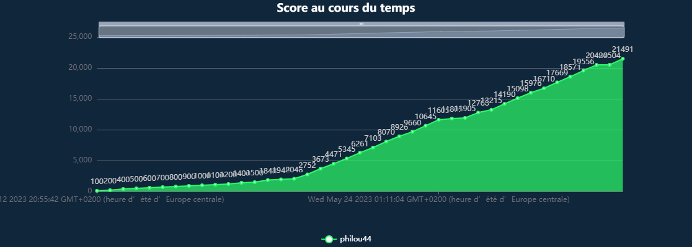

# 404CTF-2023-writeup

Voici les réflexions menées pour résoudre certains des challenges proposés lors du [404CTF 2023](https://ctf.404ctf.fr/). 
Le CTF s'est déroulé du 12 mai au 4 juin 2023 en ligne et a réuni 2335 compétiteurs.

Les 100 premiers au classement : https://www.404ctf.fr/ranking.html

## Résultat obtenu

<table>
  <tbody>
    <tr>
      <td></td>
      <td></td>
    </tr>
  </tbody>
</table>

## Challenges résolus

<table>
 <thead><tr><th>Catégorie</th><th>Challenge</th><th>Niveau</th><th>Points obtenus</th><th>Résolutions</th></tr></thead>
 <tbody>
  <tr><td rowspan=4>Analyse Forensique</td>
        <td><a href="./forensics/Peche_au_livre/Peche_au_livre.md">Pêche au livre</a></td><td style="color:green">Intro</td><td>100</td><td>1081</td></tr>
    <tr><td><a href="./forensics/c/Le_Mystere_du_roman_d_amour.md">Le Mystère du roman d'amour</a></td><td style="color:lime">Facile</td><td>200</td><td>529</td></tr>
    <tr><td><a href="./forensics/Les_Mysteres_du_cluster_de_la_Comtesse_de_Segur__1_2/Les_Mysteres_du_cluster_de_la_Comtesse_de_Segur__1_2.md">Les Mystères du cluster de la Comtesse de Ségur [1/2]</a></td><td style="color:orange">Moyen</td><td>348</td><td>317</td></tr>
    <tr><td><a href="./forensics/Lettres_volatiles/Lettres_volatiles.md">Lettres volatiles</a></td><td style="color:orange">Moyen</td><td>734</td><td>203</td></tr>

  <tr><td rowspan=5>Cloud</td>
        <td><a href="./cloud/Le_Sot/Le_Sot.md">Le Sot</a></td><td style="color:green">Intro</td><td>100</td><td>341</td></tr>
    <tr><td><a href="./cloud/Le_Cluster_de_Madame_Bovary/Le_Cluster_de_Madame_Bovary.md">Le Cluster de Madame Bovary</a></td><td style="color:lime">Facile</td><td>916</td><td>114</td></tr>
    <tr><td><a href="./cloud/Harpagon_et_le_magot/Harpagon_et_le_magot.md">Harpagon et le magot</a></td><td style="color:orange">Moyen</td><td>967</td><td>73</td></tr>
    <tr><td><a href="./cloud/Les_nuages_menacants__1_3/Les_nuages_menacants__1_3.md">Les nuages menaçants 1/3</a></td><td style="color:orange">Moyen</td><td>975</td><td>63</td></tr>
    <tr><td><a href="./cloud/Les_nuages_menacants__2_3/Les_nuages_menacants__2_3.md">Les nuages menaçants 2/3</a></td><td style="color:orange">Moyen</td><td>985</td><td>50</td></tr>

  <tr><td rowspan=6>Cryptanalyse</td>
        <td><a href="./crypto/Recette/Recette.md">Recette</a></td><td style="color:green">Intro</td><td>100</td><td>597</td></tr>
    <tr><td><a href="./crypto/Dessine_moi_une_courbe_elliptique/Dessine_moi_une_courbe_elliptique.md">Dessine-moi une courbe elliptique</a></td><td style="color:lime">Facile</td><td>798</td><td>177</td></tr>
    <tr><td><a href="./crypto/Le_Jour_de_l_espace/Le_Jour_de_l_espace.md">Le Jour de l'espace</a></td><td style="color:lime">Facile</td><td>874</td><td>140</td></tr>
    <tr><td><a href="./crypto/ASCON_Marchombre/ASCON_Marchombre.md">ASCON Marchombre</a></td><td style="color:lime">Facile</td><td>878</td><td>137</td></tr>
    <tr><td><a href="./crypto/La_Reponse_de_Voris/La_Reponse_de_Voris.md">La Réponse de Voris</a></td><td style="color:orange">Moyen</td><td>960</td><td>80</td></tr>
    <tr><td><a href="./crypto/Oracle_casse/Oracle_casse.md">Oracle cassé</a></td><td style="color:orange">Moyen</td><td>985</td><td>49</td></tr>

  <tr><td rowspan=4>Divers</td>
        <td><a href="./divers/Bienvenue/Bienvenue.md">Bienvenue !</a></td><td style="color:green">Intro</td><td>100</td><td>2335</td></tr>
    <tr><td><a href="./divers/Exemple_de_connexion_distante/Exemple_de_connexion_distante.md">Exemple de connexion distante</a></td><td style="color:green">Intro</td><td>100</td><td>1264</td></tr>
    <tr><td><a href="./divers/Discord/Discord.md">Discord</a></td><td style="color:green">Intro</td><td>100</td><td>972</td></tr>
    <tr><td><a href="./divers/A_vos_plumes/A_vos_plumes.md">À vos plumes !</a></td><td style="color:green">Intro</td><td>10</td><td>170</td></tr>

  <tr><td rowspan=4>Exploitation de binaires</td>
        <td><a href="./pwn/Je_veux_la_lune/Je_veux_la_lune.md">Je veux la lune !</a></td><td style="color:green">Intro</td><td>100</td><td>527</td></tr>
    <tr><td><a href="./pwn/L_Alchimiste/L_Alchimiste.md">L'Alchimiste</a></td><td style="color:lime">Facile</td><td>902</td><td>124</td></tr>
    <tr><td><a href="./pwn/La_Cohue/La_Cohue.md">La Cohue</a></td><td style="color:lime">Facile</td><td>938</td><td>99</td></tr>
    <tr><td><a href="./pwn/Un_tour_de_magie/Un_tour_de_magie.md">Un tour de magie</a></td><td style="color:orange">Moyen</td><td>987</td><td>47</td></tr>

  <tr><td rowspan=2>Programmation</td>
        <td><a href="./prog/L_Inondation/L_Inondation.md">L'Inondation</a></td><td style="color:green">Intro</td><td>100</td><td>521</td></tr>
    <tr><td><a href="./prog/Des_mots_des_mots_des_mots/Des_mots_des_mots_des_mots.md">Des mots, des mots, des mots</a></td><td style="color:red">Difficile</td><td>704</td><td>213</td></tr>

  <tr><td rowspan=1>Radio-fréquence</td>
        <td><a href="./radio/Avez_vous_vu_les_cascades_du_herisson/Avez_vous_vu_les_cascades_du_herisson.md">Avez-vous vu les cascades du hérisson ?</a></td><td style="color:lime">Facile</td><td>856</td><td>150</td></tr>

  <tr><td rowspan=2>Renseignement en sources ouvertes</td>
        <td><a href="./osint/Le_Tour_de_France/Le_Tour_de_France.md">Le Tour de France</a></td><td style="color:green">Intro</td><td>100</td><td>1062</td></tr>
    <tr><td><a href="./osint/L_ame_d_un_poete_et_le_coeur_d_une_femme__1_4/L_ame_d_un_poete_et_le_coeur_d_une_femme__1_4.md">L'âme d'un poète et le coeur d'une femme [1/4]</a></td><td style="color:lime">Facile</td><td>447</td><td>291</td></tr>

  <tr><td rowspan=2>Rétro-ingénierie</td>
        <td><a href="./reverse/Le_Divin_Crackme/Le_Divin_Crackme.md">Le Divin Crackme</a></td><td style="color:green">Intro</td><td>100</td><td>518</td></tr>
    <tr><td><a href="./reverse/Encore_une_mise_a_jour/Encore_une_mise_a_jour.md">Encore une mise à jour !</a></td><td style="color:lime">Facile</td><td>908</td><td>120</td></tr>

  <tr><td rowspan=3>Stéganographie</td>
        <td><a href="./stegano/Odobenus_Rosmarus/Odobenus_Rosmarus.md">Odobenus Rosmarus</a></td><td style="color:green">Intro</td><td>100</td><td>582</td></tr>
    <tr><td><a href="./stegano/L_OEuvre/L_OEuvre.md">L'Œuvre</a></td><td style="color:lime">Facile</td><td>200</td><td>783</td></tr>
    <tr><td><a href="./stegano/Les_Felicitations/Les_Felicitations.md">Les Félicitations</a></td><td style="color:lime">Facile</td><td>921</td><td>110</td></tr>

  <tr><td rowspan=2>Sécurité matérielle</td>
        <td><a href="./hardware/Un_courrier_suspect/Un_courrier_suspect.md">Un courrier suspect</a></td><td style="color:green">Intro</td><td>100</td><td>345</td></tr>
    <tr><td><a href="./hardware/Un_reveil_difficile/Un_reveil_difficile.md">Un réveil difficile</a></td><td style="color:lime">Facile</td><td>734</td><td>203</td></tr>

  <tr><td rowspan=4>Web</td>
        <td><a href="./web/Le_Loup_et_le_renard/Le_Loup_et_le_renard.md">Le Loup et le renard</a></td><td style="color:green">Intro</td><td>100</td><td>1136</td></tr>
    <tr><td><a href="./web/L_Academie_du_detail/L_Academie_du_detail.md">L'Académie du détail</a></td><td style="color:lime">Facile</td><td>200</td><td>360</td></tr>
    <tr><td><a href="./web/La_Vie_Francaise/La_Vie_Francaise.md">La Vie Française</a></td><td style="color:lime">Facile</td><td>959</td><td>81</td></tr>
    <tr><td><a href="./web/Fuite_en_1791/Fuite_en_1791.md">Fuite en 1791</a></td><td style="color:orange">Moyen</td><td>863</td><td>146</td></tr>

  <tr><td rowspan=2>Web 3</td>
        <td><a href="./web3/Art/Art.md">Art</a></td><td style="color:green">Intro</td><td>100</td><td>210</td></tr>
    <tr><td><a href="./web/L_Antiquaire_tete_en_l_air/L_Antiquaire_tete_en_l_air.md">L'Antiquaire, tête en l'air</a></td><td style="color:lime">Facile</td><td>842</td><td>156</td></tr>

 </tbody>
</table>
