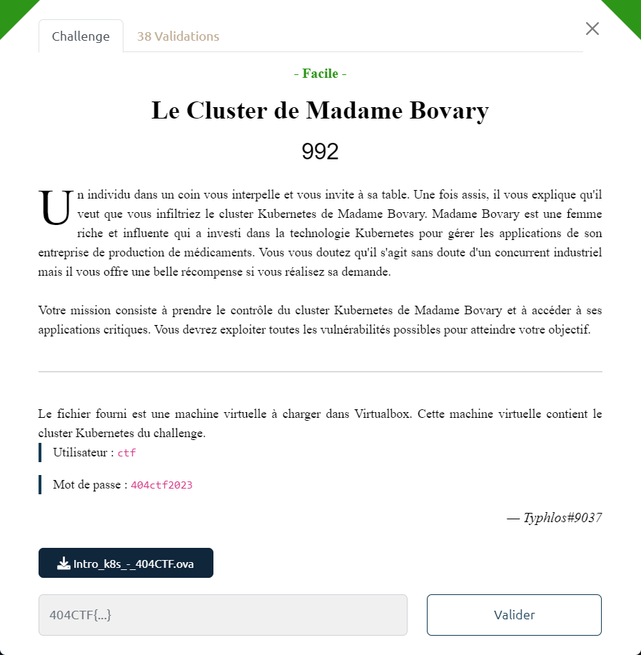

# Le Cluster de Madame Bovary



Un fichier `Intro_k8s_-_404CTF.ova` est fourni.

Comme indiqué dans l'énoncé, on se connecte à la VM fournie.

A partir d'un terminal, on requête le cluster K8S, en utilisant le CLI `kubectl` :

- Affichage de la liste des pods :

```bash
ctf@k3s:~$ kubectl get pods
NAME        READY   STATUS      RESTARTS        AGE
agent       1/1     Running     4 (20m ago)     26d
```

- Description du pod `agent`

```bash
# 1 des 2 commandes au choix
ctf@k3s:~$ kubectl describe pod/agent
ctf@k3s:~$ kubectl get pod/agent -o yaml
```

> Dans le descriptif on note que l'image utilisée est `docker.io/404ctf/agent:latest`
>
> En se rendant sur le docker hub https://hub.docker.com/u/404ctf, on trouve 3 images disponibles :
>
> | image                | entrypoint
> | -                    | -
> | 404ctf/agent         | /opt/agent
> | 404ctf/the-container | /opt/the-container
> | 404ctf/web-server    | /app/web-server
>
> Il est surement possible d'extraire le flag directement par reverse des entrypoint, mais il y a surement plus simple.
>
> Concernant l'image `404ctf/web-server`, on note que l'entrypoint est construit à partir du fichier `/app/web-server.go` qui devrait se trouver dans l'image.

- Connexion au pod `agent` et exécution du entrypoint :

```bash
ctf@k3s:~$ kubectl exec -it agent -- sh
/ # /opt/agent
Please deploy container 404ctf/the-container
Please deploy container 404ctf/the-container
Please deploy container 404ctf/the-container
^C
/ # exit
```

- Démarrage comme demandé d'un pod basé sur l'image `404ctf/the-container`

```bash
ctf@k3s:~$ kubectl run the-container --image=404ctf/the-container
```

- Connexion au pod `the-container` qu'y vient d'être déployé, et exécution de son entrypoint :

```bash
ctf@k3s:~$ kubectl exec -it the-container -- sh
/ # /opt/the-container
err: not in namespace 404ctf
err: not in namespace 404ctf
err: not in namespace 404ctf
^C
/ # exit
```

- Redéploiement du pod `the-container` sur le namespace `404ctf` :

```bash
# Création du namespace
ctf@k3s:~$ kubectl create namespace 404ctf
namespace/404ctf created

# Suppression du pod
ctf@k3s:~$ kubectl delete pod/the-container
pod "the-container" deleted

# Recréation du pod sur le namespace 404ctf
ctf@k3s:~$ kubectl -n 404ctf run the-container --image=404ctf/the-container
```

- Connexion au pod `the-container`, exécution du entrypoint et ajout des éléments manquants au fur et à mesure :

```bash
ctf@k3s:~$ kubectl -n 404ctf exec -it the-container -- sh
/ # /opt/the-container
err: /opt/my_secret_dir/ does not exist
err: /opt/my_secret_dir/ does not exist
^C
/ # mkdir /opt/my_secret_dir/
/ # /opt/the-container
Env SUPER_ENV is not set to SECRET
Env SUPER_ENV is not set to SECRET
^C
/ # export SUPER_ENV=SECRET
/ # /opt/the-container
Flag written to /opt/my_secret_dir/flag.txt
Flag written to /opt/my_secret_dir/flag.txt
^C
/ # cat /opt/my_secret_dir/flag.txt
404CTF{A_la_decouv
Le reste du flag est dans le conteneur 404ctf/web-server
/ # exit
```

> La 1ere partir du flag est donc `404CTF{A_la_decouv`
>
> Pour la suite, on va devoir déployer un pod basé sur l'image `404ctf/web-server`

- Déploiement du pod `web-server` et attente qu'il soit complètement déployé afin de pouvoir s'y connecter :

```bash
# Création du pod
ctf@k3s:~$ kubectl -n 404ctf run web-server --image=404ctf/web-server

# Tentative de connexion, avant que le déploiement soit finalisé :
ctf@k3s:~$ kubectl -n 404ctf exec -it web-server -- sh
error : unable to upgrade connection: container not found ("web-server")

# Vérification état du pod :
ctf@k3s:~$ kubectl -n 404ctf get pods
NAME            READY   STATUS              RESTARTS    AGE
the-container   1/1     Running             0           11m
web-server      0/1     ContainerCreating   0           2m48s

# On attend que le déploiement soit terminé ...
ctf@k3s:~$ kubectl -n 404ctf get pods -o wide
NAME            READY   STATUS  RESTARTS    AGE     IP          NODE
the-container   1/1     Running 0           11m     10.42.0.40  k3s
web-server      1/1     Running 0           2m48s   10.42.0.41  k3s
```

- Connexion au pod `web-server` et consultation du fichier `web-server.go` :

```bash
ctf@k3s:~$ kubectl -n 404ctf exec -it web-server -- sh
# cat /app/web-server.go
```

> La 2ème partie du flag apparaît :

```go
r.Handle("/", ... {
    fmt.Fprintf(w, "Le drapeau est dans /flag\n")
})))

r.Handle("/flag", ... {
    fmt.Fprintf(w, "erte_de_k8s}\n")
})))
...
```

> Autre façon de faire : appeler `web-server` en HTTP
>
> ```bash
> ctf@k3s:~$ curl -w'\n' 10.42.0.41:8080
> Le drapeau est dans /flag
>
> ctf@k3s:~$ curl -w'\n' 10.42.0.41:8080/flag
> erte_de_k8s}
> ```

Avec les 2 parties, le flag peut être reconstitué : `404CTF{A_la_decouverte_de_k8s}`
