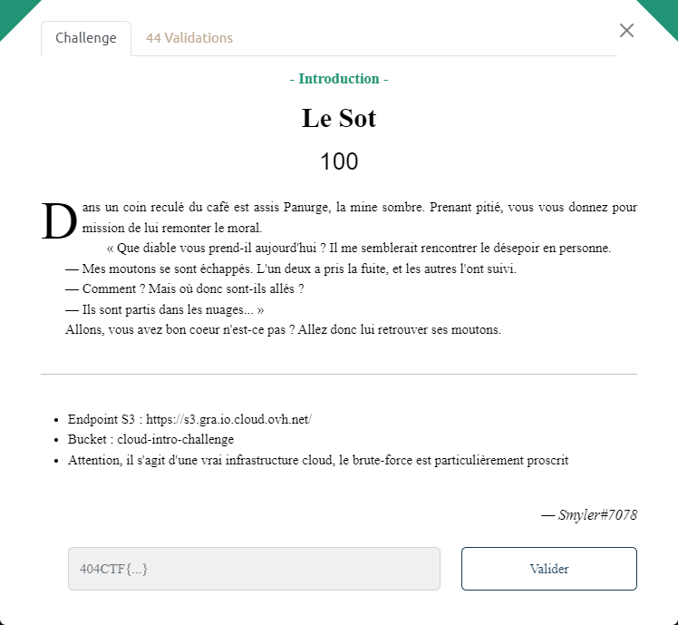

# Le Sot



Les informations indiquées dans l'énoncé précisent des éléments relatifs à un Bucket S3 :
- son endpoint : `https://s3.gra.io.cloud.ovh.net/`
- son nom : `cloud-intro-challenge`

Si celui est exposé via l'API HTTP, il devrait donc être accessible à cette URL : `https://cloud-intro-challenge.s3.gra.io.cloud.ovh.net/`

```bash
$ curl -w '\n' https://cloud-intro-challenge.s3.gra.io.cloud.ovh.net/
```

Le bucket est effectivement accessible en public :

```xml
<?xml version='1.0' encoding='UTF-8'?>
<ListBucketResult xmlns="http://s3.amazonaws.com/doc/2006-03-01/"><Name>cloud-intro-challenge</Name><Prefix/><Marker/><MaxKeys>1000</MaxKeys><IsTruncated>false</IsTruncated><Contents><Key>les-moutons.json</Key><LastModified>2023-05-12T13:56:48.000Z</LastModified><ETag>"d642390a5d6f695d958015801e585cb1"</ETag><Size>1767</Size><Owner><ID/><DisplayName/></Owner><StorageClass>STANDARD</StorageClass></Contents></ListBucketResult>
```

Il contient un seul élément `les-moutons.json` qui devrait contenir le flag recherché :

```bash
$ curl -q -w '\n' https://cloud-intro-challenge.s3.gra.io.cloud.ovh.net/les-moutons.json 2>&1|grep 404CTF

    "flag": "404CTF{D35_m0utOns_D4n5_13s_NU@g3s}"
```
