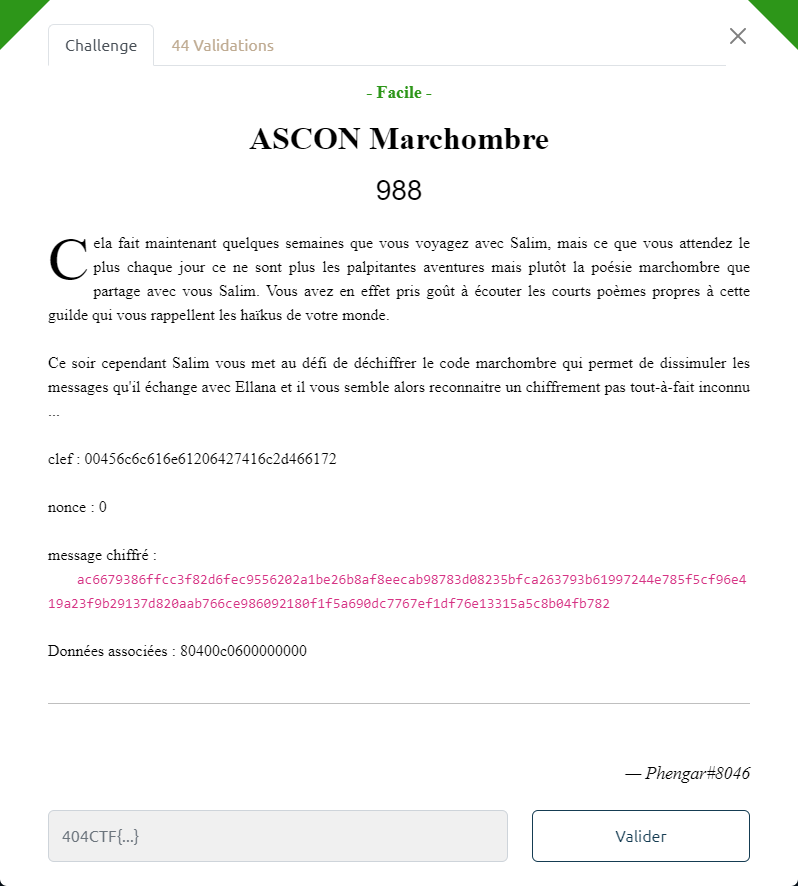

# ASCON Marchombre



ASCON est un algorithme de chiffrement symétrique : https://en.wikipedia.org/wiki/Ascon_(cipher)

On peut retrouver des implémentations pour différents langages : https://github.com/ascon/ascon_collection, dont python.

Tous les éléments présents dans l'énoncé sont nécessaires et suffisants pour procéder au déchiffrement.

Le script utilisé : [`ascon-decode.py`](ascon-decode.py)

```bash
$ python3 ascon-solution.py
clef = b"\x00Ellana d'Al-Far"
----------------------
message déchiffré brut = b"La voie de l'ombre\nEt du silence\n404CTF{V3r5_l4_lum1\xe8r3.}\nEllana"
----------------------
message déchiffré en tenant compte de l'encodage:
La voie de l'ombre
Et du silence
404CTF{V3r5_l4_lum1èr3.}
Ellana
```
