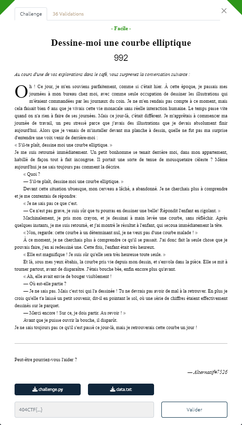

# Dessine-moi une courbe elliptique



Les fichiers fournis :
- [challenge.py](challenge.py)
- [data.txt](data.txt)

Le script `challenge.py` qui a été utilisé pour chiffrer le message à retrouver effectue les opérations suivantes :
1. génération d'une courbe elliptique basée sur un corps fini de cardinal `p`
2. chiffrement AES en mode CBC en utilisant :
    + un vecteur d'initialisation random
    + une clé de chiffrement constituée par concaténation des 2 coefficients `a` et `b` de la courbe elliptique générée.

Dans le fichier `data.txt`, on dispose :
- des coordonnées de 2 points qui sont sur la courbe elliptique
- du cardinal `p` du corps fini utilisé pour générer la courbe elliptique
- du message chiffré, au format hexa
- du vecteur d'initialisation utilisé pour le chiffrement.

Comme on connaît l'algorithme de chiffrement, et le vecteur d'initialisation utilisé, il suffit de trouver la clé pour pouvoir déchiffrer le message. A savoir retrouver les 2 coefficients `a` et `b` de la courbe elliptique.

----

L'équation d'une courbe elliptique est de la forme :

$$ y^{2} = x^{3} + a\cdot x + b \ (\bmod\ p) $$

Pour les 2 points dont on a les coordonnées `(x, y)`, on a donc :

$$ y^{2}_{1} = x^{3}_{1} + a\cdot x_{1} + b \ (\bmod\ p) $$

$$ y^{2}_{2} = x^{3}_{2} + a\cdot x_{2} + b \ (\bmod\ p) $$

Si on soustrait les 2 équations, on obtient :

$$ (y^{2}_{1} - y^{2}_{2}) = (x^{3}_{1} - x^{3}_{2}) + a\cdot (x_{1} - x_{2}) \ (\bmod\ p) $$

D'où :

$$ [\ (y^{2}_{1} - y^{2}_{2}) - (x^{3}_{1} - x^{3}_{2})\ ] \cdot (x_{1} - x_{2})^{-1} = a \ (\bmod\ p) $$

à condition que :
$$ (x_{1} - x_{2})^{-1} \ existe <=> PGCD((x_{1} - x_{2}), p) = 1$$

Une fois `a` en poche, il est facile de retrouver `b`, en utilisant les coordonnées d'un des points :

$$ b = y^{2}_{1} - (x^{3}_{1} + a\cdot x_{1}) \ (\bmod\ p)$$

----

Le script [`challenge-reverse.py`](challenge-reverse.py) implémente cet algorithme :

```bash
$ python3 challenge-reverse.py
a = 14902775479549176103916693271068277706052934716440896707334978512750519253
b = 220048944991955967308525489300590382240260882141745561912602020777012600739
key = '14902775479549176103916693271068277706052934716440896707334978512750519253220048944991955967308525489300590382240260882141745561912602020777012600739'
flag = b'404CTF{70u735_l35_gr4nd35_p3r50nn3s_0nt_d_@b0rd_373_d35_3nf4n7s}'
```
