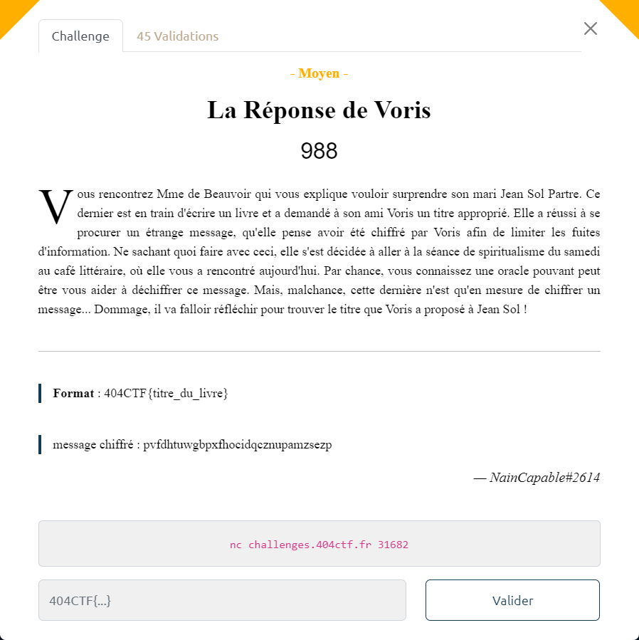

# La Réponse de Voris



On se connecte au serveur et on effectue plusieurs essais pour essayer de comprendre le comportement de la machine :

```bash
{ ~ }  » nc challenges.404ctf.fr 31682
Bienvenue dans loracle, qui chiffre ce que vous rentrez. Vous devez dechiffrer : pvfdhtuwgbpxfhocidqcznupamzsezp
message en clair : aaaaaaaaaaaaaaaaaaaaaaaaaaaaaaa
message chiffre  : gvshnmijdwalablggmejiqvrhkixhns

message en clair : aaaaaaaaaaaaaaaaaaaaaaaaaaaaaab
message chiffre  : hwtionjkexbmbcmhhnfkjrwsiljyiot

message en clair : aaaaaaaaaaaaaaaaaaaaaaaaaaaaaba
message chiffre  : hxujpoklfycncdniioglksxtjmkzjpu

...

message en clair : abaaaaaaaaaaaaaaaaaaaaaaaaaaaaa
message chiffre  : hxvlssprmglxnpawxexddmspgkjzkrw

message en clair : baaaaaaaaaaaaaaaaaaaaaaaaaaaaaa
message chiffre  : hxvlssprmglxnpawxexddmspgkjzkrx
```

De cette expérimentation, on en déduit :
- le message chiffré comporte autant de caractères que le message en clair
- il n'y a pas de découpage en bloc
- tous les caractères `[a-z]` sont acceptés : on est en base 26
- il n'y a pas d 'élément neutre' ni de 'caractère de remplissage'
- que l'algo, à partir de la base `aaaaaaaaaaaaaaaaaaaaaaaaaaaaaaa` (31 `a` car le message chiffré à retrouver comporte 31 caractères) effectue un décalage sur les caractères, différemment en fonction de la position du caractère dans le message en clair.

On utilise la même approche que celle utilisée pour le challenge [Le Jour de l'espace](../Le_Jour_de_l_espace/Le_Jour_de_l_espace.md).

On collecte les décalages obtenus pour les messages  `aaaaaaaaaaaaaaaaaaaaaaaaaaaaaab` à `baaaaaaaaaaaaaaaaaaaaaaaaaaaaaa` :
- `aaaaaaaaaaaaaaaaaaaaaaaaaaaaaab` => `hwtionjkexbmbcmhhnfkjrwsiljyiot`
- `aaaaaaaaaaaaaaaaaaaaaaaaaaaaaba` => `hxujpoklfycncdniioglksxtjmkzjpu`
- ...
- `baaaaaaaaaaaaaaaaaaaaaaaaaaaaaa` => `hxvlssprmglxnpawxexddmspgkjzkrx`

On encode les messages numériquement :
- `a` => 0
- ...
- `z` => 25

Par contre, on va utiliser le résultat du décalage obtenu pour le chiffrement de `aaaaaaaaaaaaaaaaaaaaaaaaaaaaaaa` comme constante, afin d'avoir un comportement où `a` serait un élément neutre.

On a donc :

$$ Donnée\_Chiffré = Matrice\_Chiffrement \cdot Donnée\_Clair + Constante $$

La détermination de la matrice de chiffrement ne pose pas de problème.

Par contre, celui de la matrice de déchiffrement (i.e. matrice de chiffrement carrée de dimension 31 à inverser modulo 26), prend un certain temps.
Une fois la matrice obtenue, on se servira esnuite du résultat directement dans le script.

Pour procéder au déchiffrement on applique la formule suivante :

$$ Donnée\_Clair = Matrice\_Déchiffrement \cdot (Donnée\_Chiffrée - Constante) \ (\bmod\ 26) $$

L'algorithme utilisé est implémenté dans le script [`reponse-voris.py`](reponse-voris.py) :

```bash
$ python3 reponse.py
...
message_chiffré = 'pvfdhtuwgbpxfhocidqcznupamzsezp'
message_enclair = 'lenclumedesjourneesensoleillees'
```
