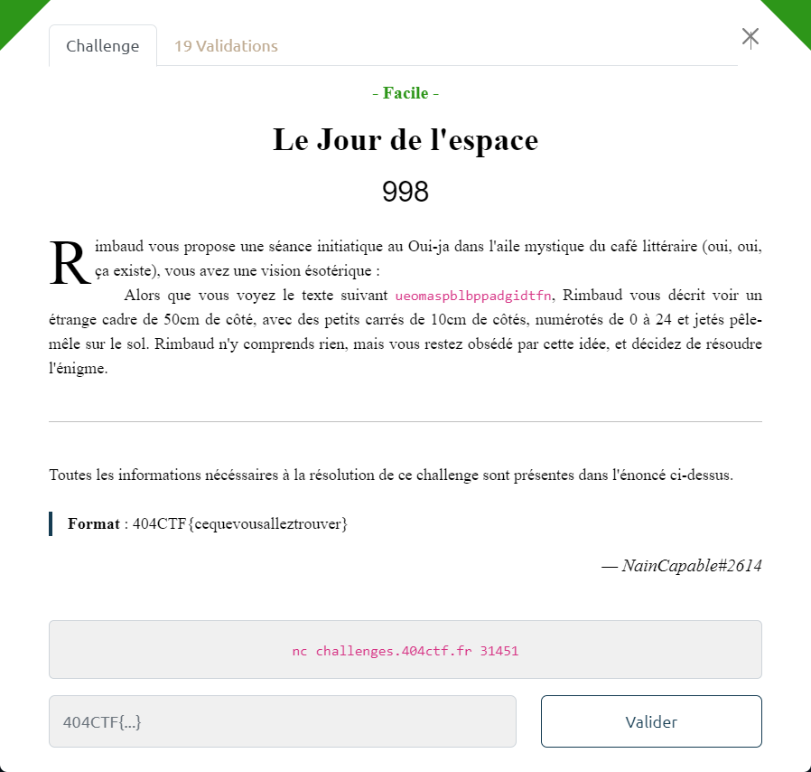

# Le Jour de l'espace



On se connecte au serveur et on effectue plusieurs essais pour essayer de comprendre le comportement de la machine :

```bash
$ nc challenges.404ctf.fr 31451
bienvenue dans loracle. Le message a dechiffrer est : ueomaspblbppadgidtfn
message en clair : a
message chiffre  : aaaaa

message en clair : aa
message chiffre  : aaaaa

message en clair : aaa
message chiffre  : aaaaa

message en clair : aaaa
message chiffre  : aaaaa

message en clair : aaaaa
message chiffre  : aaaaa

message en clair : z
caractere non valide

message en clair : b
message chiffre  : jlfnt

message en clair : ba
message chiffre  : jlfnt

message en clair : baa
message chiffre  : jlfnt

message en clair : baaa
message chiffre  : jlfnt

message en clair : baaaa
message chiffre  : jlfnt

message en clair : baaaab
message chiffre  : jlfntjlfnt

message en clair : aaaab
message chiffre  : idmry

message en clair : aaaac
message chiffre  : qgyjx

message en clair : aaaba
message chiffre  : ubkqx

message en clair : aaaca
message chiffre  : pcuhv

message en clair : aabaa
message chiffre  : schpw

message en clair : abaaa
message chiffre  : eagov

message en clair : baaaa
message chiffre  : jlfnt

message en clair : ccccc
message chiffre  : sjfas
```

De cette expérimentation, on en déduit :
- le chiffrement est fait par bloc de 5 caractères
- quel que soit le bloc, pour un même contenu en clair, le chiffré est identique. Par conséquent, le chiffrement de chaque bloc est indépendant, et c'est le même algo utilisé sur chaque bloc
- seuls les caractères `[a-y]` sont acceptés : on est en base 25 (comme le laisse penser l'énoncé avec le cadre en 5x5)
- `a` se comporte comme un 'élément neutre' ou 'caractère de remplissage' de bloc avant chiffrement :
    + `a`, `aa`, `aaa`, `aaaa`, `aaaaa`, sont tous chiffrés en `aaaaa`
    + `b`, `ba`, `baa`, `baaa`, `baaaa` donnent tous le même chiffré `jlfnt`
- que l'algo, à partir de la base `aaaaa` effectue un décalage sur les 5 caractères du bloc, différemment en fonction de la position du caractère dans le bloc en clair.

On peut représenter (i.e. encoder) les messages sous forme numérique. Pour cela, on choisit de prendre leur position dans l'alphabet, mais en commençant à `0`. Ce qui fait sens, puisque `a` se comporte comme un élément neutre.

On a donc pour chaque bloc de 5 caractères :

$$ Bloc\\_Chiffré = Matrice\\_Chiffrement \cdot Bloc\\_Clair $$

A partir des expérimentations réalisées avec les messages `aaaab`, `aaaba`, `aabaa`, `abaaa` et `baaaa`, on en déduit la matrice de chiffrement.

----

### 1ere approche : brute force

Pour toutes les combinaisons de bloc en clair de 5 caractères (i.e. `[aaaaa-yyyyy]`), on calcule le chiffré obtenu en appliquant la matrice de chiffrement.

On compare le résultat aux 4 blocs du message chiffré `ueomaspblbppadgidtfn` (i.e. `[ueoma, spblb, ppadg, idtfn]`).

Si cela correspond, on a trouvé le bloc en clair correspondant.

Cette 1ere approche est implémentée dans le script [`jour-espace.py`](jour-espace.py) :

```bash
$ python3 jour-espace.py
message_chiffre = 'ueomaspblbppadgidtfn'
ppadg <- assas
ueoma <- barja
idtfn <- sinea
spblb <- velma
message_en_clair = 'barjavelmaassassinea'
```

A noter que `a` étant neutre et utilisé comme caractère de remplissage de bloc, les `a` du dernier bloc peuvent être non significatifs (`sine` et `sinea` aboutissant au même chiffré).

Le flag est donc `404CTF{barjavelmaassassine}`

----

### 2ème approche : obtention de la matrice de déchiffrement.

En fait, on est en présence d'un chiffrement de Hill.

Voici 2 articles traitant du sujet :
- https://fr.wikipedia.org/wiki/Chiffre_de_Hill
- https://blog.noolib.com/Cours/Cryptologie-Matrice-de-Hill

Comme on est base 25, il est possible d'obtenir "facilement" et "rapidement" la matrice de déchiffrement par inversion de la matrice de chiffrement, si celle-ci est inversible.

Cette 2ème approche est implémentée dans le script [`jour-espace-2.py`](jour-espace-2.py) :

```bash
$ python3 jour-espace-2.py
message_chiffre = 'ueomaspblbppadgidtfn'
message_en_clair = 'barjavelmaassassinea'
```
