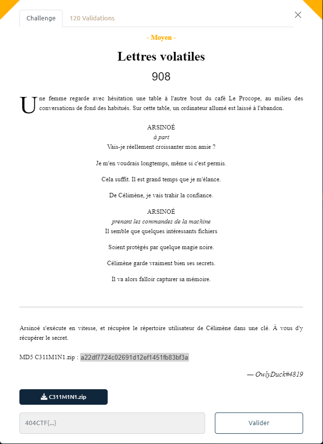

# Lettres volatiles



Un fichier `C311M1N1.zip` est fourni.

En parcourant l'archive on note la présence d'un fichier intéressant `s3cR37.zip` dans les répertoires `Downloads` et `Documents\perso`.

Dans les 2 cas impossible de lire le contenu du fichier `lettreAOronte.pdf` présent dans le ZIP : le fichier est protégé par un mot de passe.

L'archive contient également un fichier `C311M1N1-PC-20230514-200525.raw` que l'on décide d'analyser avec Volatility 3 : le mot *volatiles* dans le titre du challenge n'étant peut-être pas là par hasard.

Il s'avère que le fichier est bien une prise d'emprunte mémoire lisible avec Volatility.

On recherche d'abord les processus résidants en mémoire :

```bash
$ python3 vol.py -f C311M1N1-PC-20230514-200525.raw windows.pstree
Volatility 3 Framework 2.4.1
Progress:  100.00               PDB scanning finished
PID     PPID    ImageFileName   Offset(V)       Threads Handles SessionId       Wow64   CreateTime      ExitTime

4       0       System  0xfa8003712040  87      520     N/A     False   2023-05-14 19:54:23.000000      N/A
* 240   4       smss.exe        0xfa8004904b30  2       32      N/A     False   2023-05-14 19:54:23.000000      N/A
312     296     csrss.exe       0xfa80052cc870  9       376     0       False   2023-05-14 19:54:23.000000      N/A
352     296     wininit.exe     0xfa80054342e0  3       80      0       False   2023-05-14 19:54:24.000000      N/A
* 476   352     lsm.exe 0xfa80054e0570  10      145     0       False   2023-05-14 19:54:24.000000      N/A
* 468   352     lsass.exe       0xfa80054e2570  9       560     0       False   2023-05-14 19:54:24.000000      N/A
* 452   352     services.exe    0xfa800531eb30  7       201     0       False   2023-05-14 19:54:24.000000      N/A
** 576  452     svchost.exe     0xfa800558b060  11      370     0       False   2023-05-14 19:54:24.000000      N/A
*** 3868        576     WmiPrvSE.exe    0xfa80048ca060  5       113     0       False   2023-05-14 19:58:25.000000     N/A
** 740  452     svchost.exe     0xfa8005603060  21      461     0       False   2023-05-14 19:54:24.000000      N/A
*** 888 740     audiodg.exe     0xfa8005662060  8       151     0       False   2023-05-14 19:54:24.000000      N/A
** 1884 452     svchost.exe     0xfa8004982b30  13      324     0       False   2023-05-14 19:56:26.000000      N/A
** 1948 452     taskhost.exe    0xfa8005efd470  9       169     1       False   2023-05-14 19:54:42.000000      N/A
** 812  452     svchost.exe     0xfa8005630410  35      961     0       False   2023-05-14 19:54:24.000000      N/A
** 3052 452     SearchIndexer.  0xfa80059d51e0  14      684     0       False   2023-05-14 19:54:49.000000      N/A
*** 4792        3052    SearchFilterHo  0xfa800620e2d0  5       101     0       False   2023-05-14 20:05:21.000000     N/A
*** 4772        3052    SearchProtocol  0xfa8003a37060  8       279     0       False   2023-05-14 20:05:21.000000     N/A
** 1644 452     mscorsvw.exe    0xfa8005bb7b30  6       80      0       False   2023-05-14 19:56:26.000000      N/A
** 784  452     svchost.exe     0xfa800560ab30  20      450     0       False   2023-05-14 19:54:24.000000      N/A
*** 1188        784     dwm.exe 0xfa8005f48060  3       75      1       False   2023-05-14 19:54:42.000000      N/A
** 656  452     svchost.exe     0xfa800558fb30  10      301     0       False   2023-05-14 19:54:24.000000      N/A
** 1104 452     svchost.exe     0xfa80057afb30  17      316     0       False   2023-05-14 19:54:25.000000      N/A
** 1200 452     svchost.exe     0xfa8005829630  15      291     0       False   2023-05-14 19:54:25.000000      N/A
** 1076 452     spoolsv.exe     0xfa80057a2060  13      294     0       False   2023-05-14 19:54:25.000000      N/A
** 284  452     svchost.exe     0xfa800568fb30  17      405     0       False   2023-05-14 19:54:24.000000      N/A
** 2224 452     mscorsvw.exe    0xfa800582c9f0  6       86      0       True    2023-05-14 19:56:25.000000      N/A
** 1688 452     sppsvc.exe      0xfa8005eae320  4       148     0       False   2023-05-14 19:56:26.000000      N/A
** 956  452     svchost.exe     0xfa800568cb30  10      278     0       False   2023-05-14 19:54:24.000000      N/A
372     360     csrss.exe       0xfa8005438b30  9       659     1       False   2023-05-14 19:54:24.000000      N/A
* 5044  372     conhost.exe     0xfa8003ac4670  2       54      1       False   2023-05-14 20:05:25.000000      N/A
* 4756  372     conhost.exe     0xfa8003a64660  2       54      1       False   2023-05-14 20:05:21.000000      N/A
408     360     winlogon.exe    0xfa8005451530  5       119     1       False   2023-05-14 19:54:24.000000      N/A
840     2024    explorer.exe    0xfa8005f5d390  39      1068    1       False   2023-05-14 19:54:42.000000      N/A
* 4748  840     cmd.exe 0xfa8006320480  5       131     1       False   2023-05-14 20:05:21.000000      N/A
** 5036 4748    DumpIt.exe      0xfa8003b05060  2       51      1       True    2023-05-14 20:05:25.000000      N/A
* 4188  840     notepad.exe     0xfa8003d3c060  1       60      1       False   2023-05-14 20:02:09.000000      N/A
308     1292    firefox.exe     0xfa800574aa30  82      1553    1       True    2023-05-14 19:54:46.000000      N/A
* 1280  308     firefox.exe     0xfa8006002b30  35      411     1       True    2023-05-14 19:54:47.000000      N/A
* 192   308     firefox.exe     0xfa8003a6f380  22      263     1       True    2023-05-14 19:59:15.000000      N/A
* 1056  308     firefox.exe     0xfa8003be6b30  15      235     1       True    2023-05-14 20:01:49.000000      N/A
* 2248  308     firefox.exe     0xfa800612ab30  22      267     1       True    2023-05-14 19:54:47.000000      N/A
* 2888  308     firefox.exe     0xfa800396cb30  22      260     1       True    2023-05-14 19:58:48.000000      N/A
* 4028  308     firefox.exe     0xfa80038dc060  37      344     1       True    2023-05-14 19:58:44.000000      N/A
* 3784  308     firefox.exe     0xfa8003adf990  8       179     1       True    2023-05-14 19:59:15.000000      N/A
* 3788  308     firefox.exe     0xfa8003aa7060  8       183     1       True    2023-05-14 19:59:15.000000      N/A
* 1864  308     firefox.exe     0xfa8003bec060  26      286     1       True    2023-05-14 19:59:48.000000      N/A
* 3980  308     firefox.exe     0xfa800399cb30  23      265     1       True    2023-05-14 20:01:07.000000      N/A
* 3528  308     firefox.exe     0xfa800396ab30  25      276     1       True    2023-05-14 20:01:12.000000      N/A
* 3632  308     firefox.exe     0xfa8003ad7060  24      276     1       True    2023-05-14 19:59:52.000000      N/A
* 3080  308     firefox.exe     0xfa80039fd060  15      233     1       True    2023-05-14 20:01:22.000000      N/A
* 3220  308     firefox.exe     0xfa80048c5060  22      259     1       True    2023-05-14 19:57:43.000000      N/A
* 1588  308     firefox.exe     0xfa8003b9fb30  9       156     1       True    2023-05-14 19:59:27.000000      N/A
* 4084  308     firefox.exe     0xfa800610f770  15      234     1       True    2023-05-14 20:01:20.000000      N/A
* 2456  308     firefox.exe     0xfa80061c3b30  22      272     1       True    2023-05-14 19:54:47.000000      N/A
* 2076  308     firefox.exe     0xfa80060d8960  6       161     1       True    2023-05-14 19:54:47.000000      N/A
```

On note que le process `4188` correspond à notepad. Peut-être des informations intéressantes à récupérer dans la mémoire du Bloc Note ?

On extrait donc les données en mémoire pour ce process :
```bash
$ python3 vol.py -f C311M1N1-PC-20230514-200525.raw windows.memmap --pid 4188 --dump
```

On obtient un fichier `pid.4188.dmp`

On peut parcourir le fichier ou rechercher des chaines de caractères intéressantes (comme `zip`) :
```bash
$ strings -el pid.4188.dmp|grep -C10 zip
Z1p p4s5wOrd : F3eMoBon8n3GD5xQ
Z1p p4s5wOrd : F3eMoBon8n3GD5xQ
Z1p p4s5wOrd : F3eMoBon8n3GD5xQ
Z1p p4s5wOrd : F3eMoBon8n3GD5xQ
Z1p p4s5wOrd : F3eMoBon8n3GD5xQ
 faire, donner le mot de passe zip
 Oronte
wOrd : F3eMoBon8n3GD5xQ
Z1p p4s5wOrd : F3eMoBon8n3GD5xQ
Z1p p4s5wOrd : F3eMoBon8n3GD5xQ
...
```

On essaie d'ouvrir le fichier `lettreAOronte.pdf` en utilisant `F3eMoBon8n3GD5xQ` comme mot de passe : Bingo!!

En bas du PDF on trouve le flag : `404CTF{V0147i1I7y_W1Ll_N3v3r_Wr8_loV3_l3ttEr5}`
