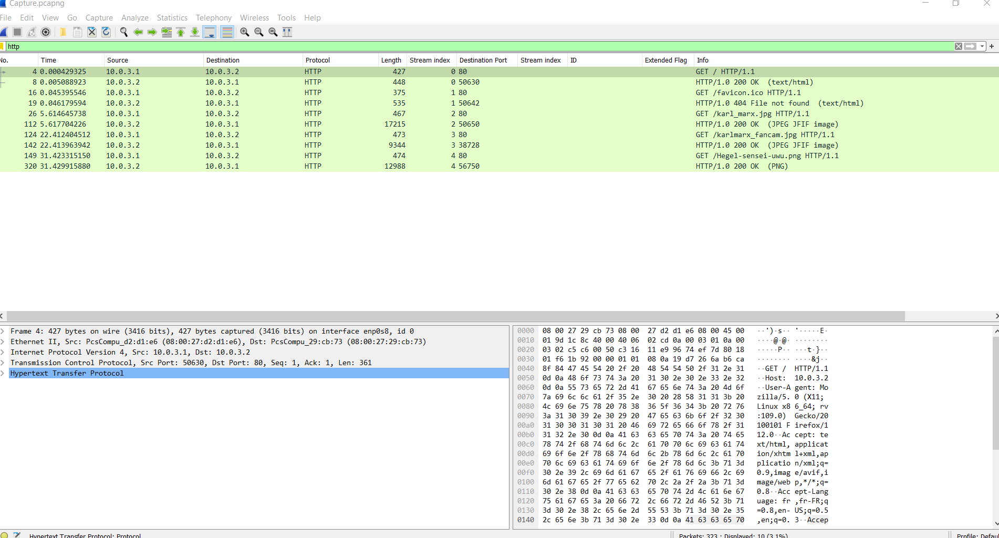
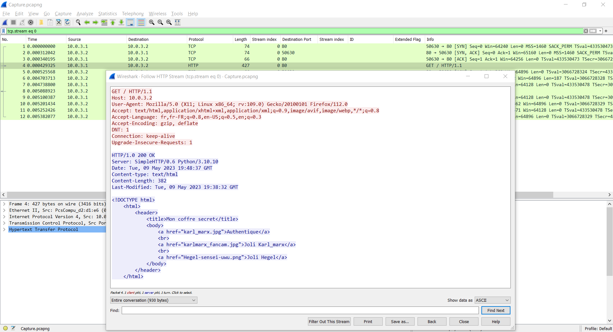
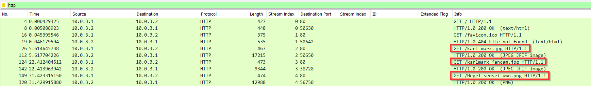

# Pêche au livre

Le fichier fourni : [Capture.pcapng](Capture.pcapng)

On utilise Wireshark pour ouvrir le fichier `Capture.pcapng`.

On filtre, pour ne conserver que les requêtes HTTP :

On sélectionne la 1ere trame HTTP, et on suit le flux (Click droit > Follow > HTTP Stream) :

La réponse fait apparaître 3 liens vers des fichiers.

Ces 3 fichiers ont bien été téléchargés :

On les exporte (File > Export Objects > HTTP)

Le flag est présent dans le fichier image `Hegel-sensei-uwu.png` :

