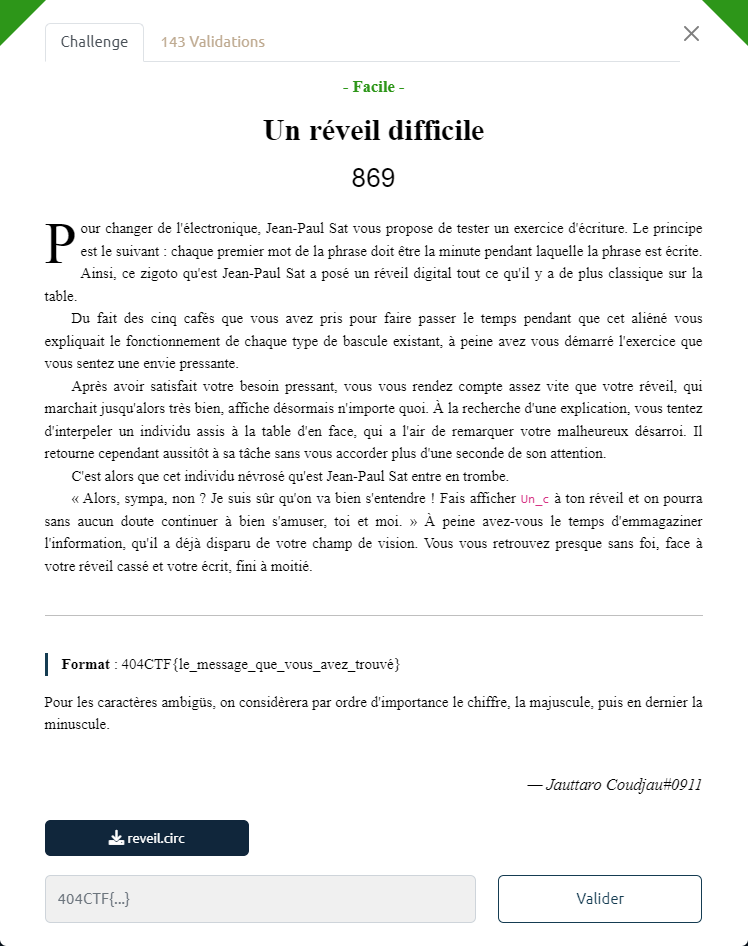
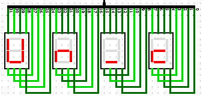
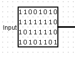
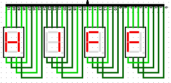
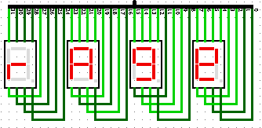
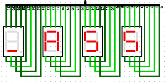
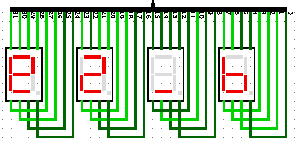
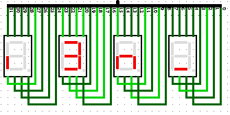
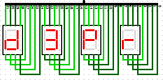
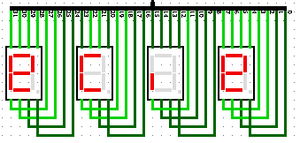

# Un réveil difficile

Le fichier fourni : [reveil.circ](reveil.circ)

On ouvre le fichier fourni avec [Logisim](http://www.cburch.com/logisim/).

En lançant la simulation, on s'aperçoit qu'en fait la blackbox applique un [XNOR](https://fr.wikipedia.org/wiki/Co%C3%AFncidence_(informatique)) bit à bit entre les 2 entrées.
- si les 2 bits sont égaux, on obtient 1, sinon on obtient 0
- XNOR =  NOT XOR

D'après l'indice de l'énoncé, on comprend qu'il faut faire en sorte que le 1er affichage soit `Un_c`

Ce qui correspond à : `01011110 10001010 00000100 10001100`

On lance la simulation en pas à pas, afin d'obtenir la valeur obtenue en sortie des 2 MUX, dans ce cas.

La valeur est : `01101011 10001011 01000101 11011110`

Donc la constante en input doit être le XNOR des 2 autres, soit `11001010 11111110 10111110 10101101` :

On lance la simulation avec cette entrée et on obtient le flag par morceaux :

Il suffit alors de bien lire la règle indiquée pour lever les ambiguités, et trouver le flag : `404CTF{Un_cH1FFrA9e_A55e2_bi3n_d3PreCie}`
