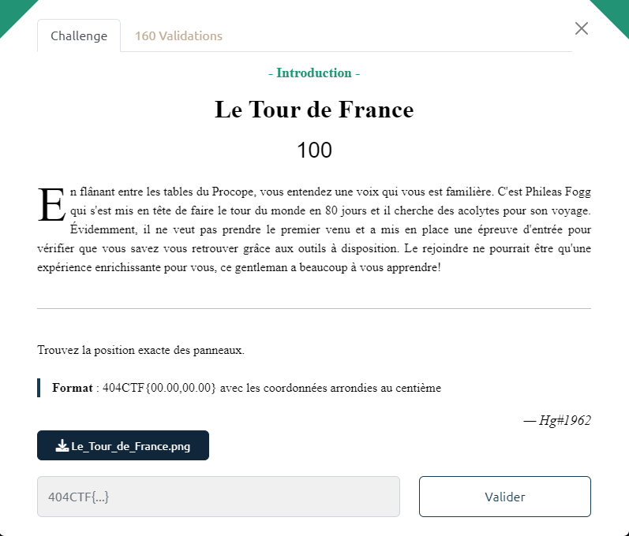

# Le Tour de France

Le fichier fourni : [Le_Tour_de_France.png](Le_Tour_de_France.png)

En effectuant une recherche de la photo dans GoogleImage, on la retrouve dans un article indiquant qu'il s'agit de la jonction entre l'A6 et l'A31.

GoogleMaps permet d'en retrouver les coordonnées GPS approximatives.

On obtient ainsi le flag : `404CTF{47.02,04.87}`
