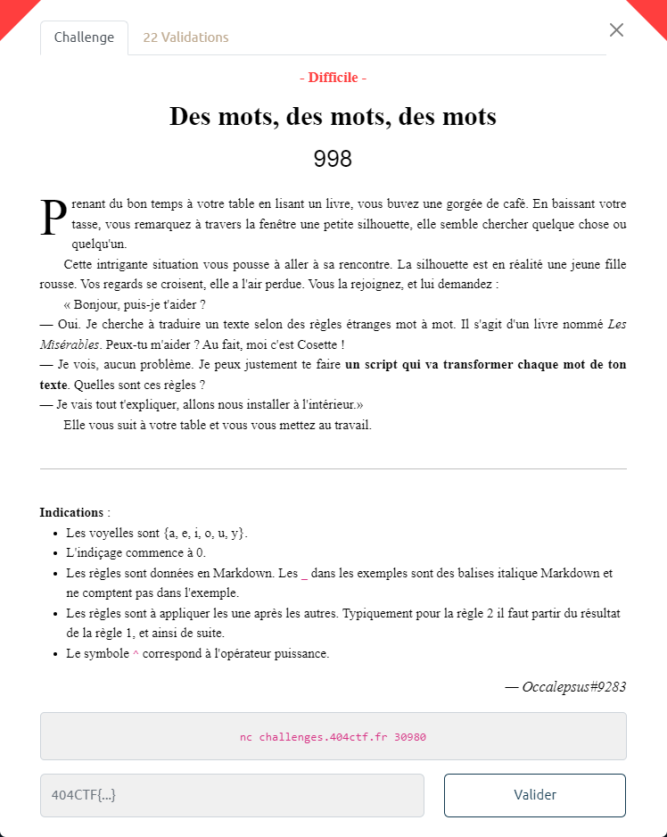

# Des mots, des mots, des mots



On se connecte au serveur :

```bash
$ nc challenges.404ctf.fr 30980
Commençons. Je te propose de démarrer en transformant mon nom.
Tout d'abord retourne mon nom sans modifications.
Règle 0 : Aucune modification
Entrée : {cosette}
>> cosette
Je vois que tu as compris. La première règle de ce langage est très simple.
Règle 1 : Inverser les lettres
Entrée : {cosette}
>> ettesoc
Oui c'est bien. Maintenant la deuxième règle est un peu plus difficile.
Règle 2 :
- Si le mot à un nombre de lettres pair, échanger la 1ere et la 2e partie du mot obtenu
- Sinon, enlever toutes les lettres du mot correspondant à la lettre centrale
Entrée : {cosette}
>> ttsoc
Tu t'en sors très bien ! Continuons avec la troisième règle.
Règle 3 :
_Si le mot a 3 lettres ou plus_ :

- Si la 3e lettre du mot obtenu est une consonne, "décaler" les voyelles vers la gauche dans le mot original, puis réappliquer les règles 1 et 2.
- Sinon : la même chose mais les décaler vers la droite.

> Ex de décalage : _poteau => petauo_ // _drapeau => drupaea_
Entrée : {cosette}
>> ottsc
Nous avons presque fini, la quatrième règle est la plus complexe.
Règle 4 :
- Pour `n` allant de 0 à la fin du mot, si le caractère `c` à la position `n` du mot est une consonne (majuscule ou minuscule), insérer en position `n+1` le caractère de code ASCII `a = ((vp + s) % 95) + 32`, où `vp` est le code ASCII de la voyelle précédant la consonne `c` dans l'alphabet (si `c = 'F'`, `vp = 'E'`), et `s = SOMME{i=n-1 -> 0}(a{i}*2^(n-i)*Id(l{i} est une voyelle))`, où `a{i}` est le code ASCII de la `i`-ième lettre du mot, `Id(x)` vaut `1` si `x` est vrai, `0` sinon, et `l{i}` la `i`-ième lettre du mot. _Attention à bien appliquer cette règle aussi sur les caractères insérés au mot._

> Ex : _futur => f&ut\ur@_

- Enfin, trier le mot par ordre décroissant d'occurrences des caractères, puis par ordre croissant en code ASCII pour les égalités

> Ex de tri : _patate => aattep_
Entrée : {cosette}
>> PPtt!15QRUWcos
Bravo ! Maintenant je vais te donner un chapitre dont j'ai besoin de la traduction complète.
Chaque mot est écrit en minuscule sans accents ni caractères spéciaux et sont séparés par un espace. Tu as 5 secondes pour répondre.
Entrée : {palais episcopal digne etait attenant hopital palais episcopal etait vaste hotel pierre commencement siecle dernier monseigneur henri puget docteur theologie faculte paris simore lequel etait eveque digne palais etait logis seigneurial avait grand appartements eveque salons antichambres honneur large promenoirs arcades selon ancienne florentine jardins plantes magnifiques arbres salle manger longue superbe galerie etait chaussee ouvrait jardins monseigneur henri puget avait donne manger ceremonie juillet messeigneurs charles brulart genlis archeveque prince embrun antoine mesgrigny capucin eveque grasse philippe vendome grand prieur france saint honore lerins francois berton grillon eveque baron vence cesar sabran forcalquier eveque seigneur glandeve soanen pretre oratoire}
>> 
```

Le début est un tutoriel indiquant les différentes règles (1 à 4) à appliquer successivement. Puis il faut fournir en retour l'application de ces règles sur une liste de mots.

Les différentes règles et la communication avec le serveur sont implémentées dans le script [`mots.py`](mots.py) :

```bash
$ python3 mots.py
r1= ettesoc
r2= ttsoc
r3= ottsc
r4= PPtt!15QRUWcos
tepoua aeaurd
[+] Opening connection to challenges.404ctf.fr on port 30980: Done
maintenant donner passa cette table saurions mieux faire transcrire passage lettre mademoiselle baptistine madame boischevron conversation forcat eveque racontee minutie naive homme faisait aucune attention personne mangeait voracite affame cependant apres soupe monsieur encore rouliers voulu laisser manger meilleure chere entre observation choquee frere repondu fatigue repris homme argent pauvre seulement exemple etait juste devriez juste frere moment apres ajoute monsieur valjean pontarlier allez itineraire oblige crois comme homme continue route demain pointe voyager nuits froides journees chaudes allez repris frere revolution famille ruinee refugie franche comte abord quelque temps travail avais bonne volonte trouve occuper choisir papeteries tanneries distilleries
nnnaatt*,06>F`eim nn*.ANR`deor aa<p ee;FNc .\aelt ss.01IXafginoru 6AQSbefgkmnsux *DUefir rrrBB#*068<H`aceinst aa%*egp eett+06=dlr eeellmm%'26<Z^adiosz aaaPPiitt*1CDSUV\bemnpqrs aamm".ANRde oooPP*1AM[`bceiknrsv ::__nnooss*0OWacdeirtv cc*0@Eafort eee2Bquvy ee&*0\acnort <<?Zefmntuz 2JYeinv ehior aaii 0Sfjt uu"acen~ ttt"2FIXaefgio 00eenn/<KL_oprs aa!&*>egimnt PPaa-1[ceiortv &&aaff>Fem ee.05Vacdpt~ 04aeps  \epsu nn*0VW_deimorsu{ ee"*7chnor iirr(*Celosu| JJ+[lov /0aeilr *.6`aegmnr eee\imru} "&0chr <<eeZnrz oo */\abeinrst} eee_chlou 00rr&f .18<Zdenoprz !!:aefgit rrss*0CDSVW\_deipq ehior <<&0Zaegnrtz 04GYaeprtuv ***0\lmnstu eee&6F`lpx tt0<ae \ejtuy eevv 3:dijz \ejtuy 00rr&f mm*,6`enot 04aeps .Uaejotu nn*0VW_deimorsu{ aa*>Felnv~ eerr */=DKLMOPaijklnopt :aez iiieerr&>^anotz "*Rbeghilowy PPP01EGcors cc5eno ehior nn*.09ceiotu  \ertu &*:adeimn 4:\einopt FF'*0Hagorvy 00>inst BB"#/0dfiors eeoovv0cjnrsu|} &0\acdhirsu :aez rrss*0CDSVW\_deipq 00rr&f ??oo*,befilnrtuvz| ll./:EKLafijm eennV\iru{ ee4AGJORfgru *2]acefhr{ PP$1ceotx ""0bdor eeqquu&5 00<epst aa"*\ilrt aa0:sv 5bceno PPoo1?@Olntv "E\eortuv PPPcccEE01Gopru ii*0@D]chrs eeepp+0<=adirstu eenn *0=@DKMPakrst iiieellsstt*1:<QY^`dr
[+] Receiving all data: Done (107B)
[*] Closed connection to challenges.404ctf.fr port 30980
Merci ! C'est exactement ce qu'il me fallait !
Voici ta récompense : 404CTF{:T]cdeikm_)W_doprsu_nt_;adei}
```
