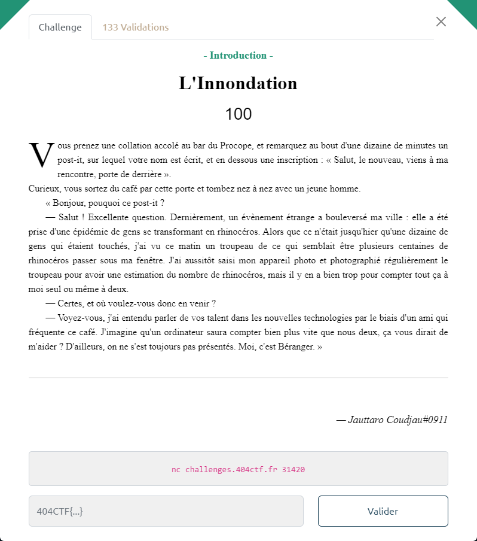

# L'Inondation



On se connecte au serveur :

```bash
$ nc challenges.404ctf.fr 31420
« Allez, vite, il y a une pile de photos assez importante à traiter,
comptes-moi le nombre de rhinos par photo. »
                ~c`°^)                                                                    ~c`°^)
                          ~c`°^)          ~c`°^)    ~c`°^)  ~c`°^)            ~c`°^)    ~c`°^)
                                                                                       ~c`°^)
  ~c`°^)          ~c`°^)    ~c`°^)  ~c`°^)                      ~c`°^)              ~c`°^)
                ~c`°^)  ~c`°^)                                 ~c`°^)
    ~c`°^)  ~c`°^)                                 ~c`°^)                   ~c`°^)
                  ~c`°^)    ~c`°^)                              ~c`°^)  ~c`°^)
      ~c`°^)               ~c`°^)                                                   ~c`°^)
                        ~c`°^)          ~c`°^)                          ~c`°^)
                            ~c`°^)               ~c`°^)     ~c`°^)      ~c`°^)      ~c`°^)
~c`°^)                  ~c`°^)       ~c`°^)     ~c`°^)      ~c`°^)      ~c`°^)        ~c`°^)
            ~c`°^)                              ~c`°^)                                  ~c`°^)
~c`°^)                  ~c`°^)                  ~c`°^)                      ~c`°^)  ~c`°^)
 ~c`°^)     ~c`°^)                                              ~c`°^)                ~c`°^)
~c`°^)      ~c`°^)      ~c`°^)                      ~c`°^)  ~c`°^)                      ~c`°^)
                          ~c`°^)        ~c`°^)                              ~c`°^)
                            ~c`°^)                              ~c`°^)      ~c`°^)        ~c`°^)
  ~c`°^)        ~c`°^)  ~c`°^)                      ~c`°^)                             ~c`°^)
    ~c`°^)                ~c`°^)        ~c`°^)      ~c`°^)                               ~c`°^)
              ~c`°^)                    ~c`°^)        ~c`°^)   ~c`°^)                ~c`°^)
  ~c`°^)                                  ~c`°^)   ~c`°^)                ~c`°^)
    ~c`°^)                             ~c`°^)        ~c`°^)  ~c`°^)       ~c`°^)     ~c`°^)
                  ~c`°^)   ~c`°^)                                        ~c`°^)     ~c`°^)
      ~c`°^)                         ~c`°^)       ~c`°^)                ~c`°^)          ~c`°^)
                 ~c`°^)                                     ~c`°^)
                          ~c`°^)     ~c`°^)     ~c`°^)          ~c`°^)
                         ~c`°^)                     ~c`°^)        ~c`°^)   ~c`°^)   ~c`°^)
  ~c`°^)     ~c`°^)                     ~c`°^)        ~c`°^)   ~c`°^)   ~c`°^)
 ~c`°^)                                   ~c`°^)            ~c`°^)          ~c`°^)  ~c`°^)
~c`°^)          ~c`°^)                 ~c`°^)   ~c`°^)          ~c`°^)              ~c`°^)
                                                                                    ~c`°^)
                                                ~c`°^)      ~c`°^)      ~c`°^)
Combien de rhinocéros comptez-vous dans cette image ?
Votre réponse :
>
« Il faut compter plus rapidement, j'ai pas tout le temps du monde ! »
```

Le challenge consiste donc à compter le nombre de "rhinos" représentés chacun par ``~c`°^)``

A noter que l'exercice est à réaliser 100 fois, avant d'obtenir le flag.

On réalise les opérations (récupération de l'image, dénombrement des rhinos, envoi de la réponse) via le script [`Innondation.py`](Innondation.py) :

```bash
$ python3 innondation.py
[+] Opening connection to challenges.404ctf.fr on port 31420: Done
[+] Receiving all data: Done (330B)
[*] Closed connection to challenges.404ctf.fr port 31420
« Très bien, la suite arrive ! »
« Bien joué ! Avant que tu partes, ta récompense. »

Il vous tend une enveloppe.
 « Ouvres-la une fois qu'il n'y a personne autour de toi. »
Vous faites exactement cela, à l'intérieur se trouve un billet, et une lettre. Dessus il est marqué 404CTF{4h,_l3s_P0uvo1rs_d3_l'iNforM4tiqu3!}
```
