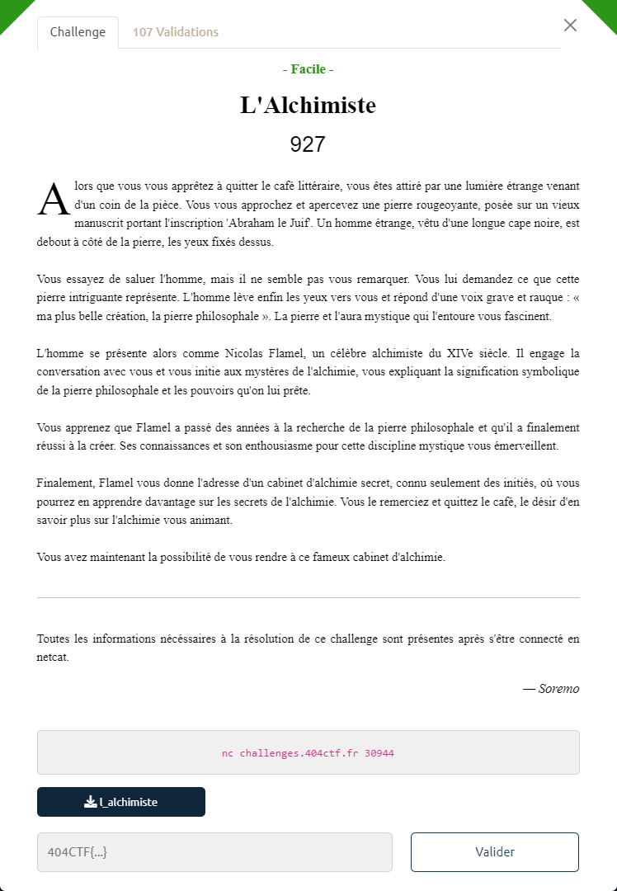

# L'Alchimiste



Le fichier fourni : [l_alchimiste](l_alchimiste)

Ce fichier est un binaire 64 bits :
```bash
$ file l_alchimiste
l_alchimiste: ELF 64-bit LSB executable, x86-64, version 1 (SYSV), dynamically linked, interpreter /lib64/ld-linux-x86-64.so.2, for GNU/Linux 3.2.0, BuildID[sha1]=387e6993824f1285884eaa1310ddb64709effc7f, not stripped`
```

L'exécution du binaire lance un jeu :

```bash
$ ./l_alchimiste
[Alchimiste] : En entrant ici, vous avez fait le premier pas vers l'aventure mystique de l'alchimie, où la recherche de la connaissance et de la sagesse est sans fin.
[Alchimiste] : Montrez-moi votre force et votre intelligence, et je vous donnerai la clé de la porte de la connaissance.

[Alchimiste] : N'hésitez pas à faire un tour dans mon modeste laboratoire, je suis sûr que vous trouverez quelque chose qui vous aidera à progresser.

1: Acheter un élixir de force
2: Consommer un élixir de force
3: Parler à l'alchimiste
4: Montrer mes caractéristiques
5: Obtenir la clé
6: Sortir du cabinet d'alchimie
>>> 4
Voici une estimation numérique de vos caractéristiques:

        FOR: 100
        INT: 50
        OR: 100
1: Acheter un élixir de force
2: Consommer un élixir de force
3: Parler à l'alchimiste
4: Montrer mes caractéristiques
5: Obtenir la clé
6: Sortir du cabinet d'alchimie
>>> 5
[Alchimiste] : Vous n'avez pas prouvé votre valeur.

1: Acheter un élixir de force
2: Consommer un élixir de force
3: Parler à l'alchimiste
4: Montrer mes caractéristiques
5: Obtenir la clé
6: Sortir du cabinet d'alchimie
>>> 2
[Alchimiste] : Vous n'avez pas d'élixir de force en votre possession.

1: Acheter un élixir de force
2: Consommer un élixir de force
3: Parler à l'alchimiste
4: Montrer mes caractéristiques
5: Obtenir la clé
6: Sortir du cabinet d'alchimie
>>> 1

***** Achat d'un élixir de force
***** ~ 0x20856d0

1: Acheter un élixir de force
2: Consommer un élixir de force
3: Parler à l'alchimiste
4: Montrer mes caractéristiques
5: Obtenir la clé
6: Sortir du cabinet d'alchimie
>>> 2

***** Elixir consommé
***** Vous sentez votre force augmenter.
***** ~ 0x20856d0

1: Acheter un élixir de force
2: Consommer un élixir de force
3: Parler à l'alchimiste
4: Montrer mes caractéristiques
5: Obtenir la clé
6: Sortir du cabinet d'alchimie
>>> 3

[Vous] : Bonjour
***** ~ 0x20856d0

1: Acheter un élixir de force
2: Consommer un élixir de force
3: Parler à l'alchimiste
4: Montrer mes caractéristiques
5: Obtenir la clé
6: Sortir du cabinet d'alchimie
>>> 4
Voici une estimation numérique de vos caractéristiques:

        FOR: 110
        INT: 50
        OR: 50
1: Acheter un élixir de force
2: Consommer un élixir de force
3: Parler à l'alchimiste
4: Montrer mes caractéristiques
5: Obtenir la clé
6: Sortir du cabinet d'alchimie
>>> 5
[Alchimiste] : Vous n'avez pas prouvé votre valeur.

1: Acheter un élixir de force
2: Consommer un élixir de force
3: Parler à l'alchimiste
4: Montrer mes caractéristiques
5: Obtenir la clé
6: Sortir du cabinet d'alchimie
>>> 6
```

On décompile le binaire avec Ghidra.

La fonction `main` gère la création du personnage via la fonction `createCharacter`, puis la boucle d'interaction :

```c
void main(void)
{
  int iVar1;
  long in_FS_OFFSET;
  int local_1c;
  undefined8 local_18;
  undefined8 local_10;
  
  local_10 = *(undefined8 *)(in_FS_OFFSET + 0x28);
  setvbuf(stdout,(char *)0x0,2,0);
  local_18 = createCharacter(100,0x32,100);
  puts(&DAT_00400fd8);
  puts(&DAT_00401080);
  puts(&DAT_00401100);
  do {
    puts(&DAT_004011a0);
    puts(&DAT_004011c0);
    puts(&DAT_004011e1);
    puts(&DAT_00401200);
    puts(&DAT_00401221);
    puts("6: Sortir du cabinet d\'alchimie");
    printf(">>> ");
    fflush(stdout);
    iVar1 = __isoc99_scanf(&DAT_0040125d,&local_1c);
    if (iVar1 != 1) {
                    /* WARNING: Subroutine does not return */
      exit(0);
    }
    if (local_1c < 1) goto LAB_00400cb2;
    switch(local_1c) {
    case 0:
      break;
    case 1:
      buyStrUpPotion(local_18);
      break;
    case 2:
      useItem(local_18);
      break;
    case 3:
      sendMessage();
      break;
    case 4:
      showStats(local_18);
      break;
    case 5:
      view_flag(local_18);
      break;
    case 6:
                    /* WARNING: Subroutine does not return */
      exit(0);
    default:
LAB_00400cb2:
                    /* WARNING: Subroutine does not return */
      exit(0);
    }
  } while( true );
}
```

L'obtention du flag est pilotée par la fonction `view_flag` :

```c
void view_flag(int *param_1)
{
  FILE *__stream;
  char *pcVar1;
  long in_FS_OFFSET;
  char local_58 [72];
  long local_10;
  
  local_10 = *(long *)(in_FS_OFFSET + 0x28);
  if ((*param_1 < 0x96) || (param_1[1] < 0x96)) {
    puts(&DAT_00400f28);
  }
  else {
    __stream = fopen("flag.txt","r");
    if (__stream == (FILE *)0x0) {
                    /* WARNING: Subroutine does not return */
      exit(0);
    }
    pcVar1 = fgets(local_58,0x40,__stream);
    if (pcVar1 != (char *)0x0) {
      puts(&DAT_00400f68);
      puts("-----------------------------------------------");
      puts(local_58);
      puts("-----------------------------------------------");
                    /* WARNING: Subroutine does not return */
      exit(0);
    }
  }
  if (local_10 != *(long *)(in_FS_OFFSET + 0x28)) {
                    /* WARNING: Subroutine does not return */
    __stack_chk_fail();
  }
  return;
}
```

Pour l'obtenir il est nécessaire que la FORce (`*param1`) et l'INTelligence (`param_1[1]`) soient toutes les deux au moins égales à `0x96` (i.e. `150`).

----

La fonction `buyStrUpPotion` permet d'acheter un élixir :

```c
void buyStrUpPotion(long param_1)
{
  undefined8 *puVar1;
  
  puts(&DAT_00400dc8);
  puVar1 = (undefined8 *)malloc(0x48);
  printf("***** ~ %p\n",puVar1);
  *puVar1 = 0x6420726978696c45;
  puVar1[1] = 0x6563726f662065;
  puVar1[8] = incStr;
  if (*(int *)(param_1 + 8) < 0x32) {
    puts(&DAT_00400df8);
  }
  else {
    *(undefined8 **)(param_1 + 0x10) = puVar1;
    *(int *)(param_1 + 8) = *(int *)(param_1 + 8) + -0x32;
  }
  return;
}
```
`0x48` (i.e. `72`) octets sont alloués en mémoire (`puVar1`). On y stocke la chaîne `0x6420726978696c45` + `0x6420726978696c45` (i.e. en little-endian `Elixir de force`), mais aussi l'adresse de la function `incStr` (i.e. `0x004008f1`) en `puVar1[8]`.<br>
Comme on est en 64 bits, les adresses sont sur 8 bits. On a donc :  `puVar1[8] = *puVar1+(8*8)`.

L'achat est possible si on dispose d'assez d'OR (`*(param_1 + 8)`). Il en faut au minium `0x32` (i.e. `50`).

Si c'est le cas, l'adresse mémoire allouée est positionnée dans les caractéristiques du personnage (`*(param1 + 0x10)`) : une sorte de marqueur d'achat.

En résumé, à l'issue de l'achat :
- `puVar1` est composé de 72 octets, débutant par la chaine `Elixir de force`, et finissant (sur les 8 derniers octets) par l'adresse mémoire de `IncStr`.
- un marqueur vers l'adresse en mémoire de `puVar1` est positionné dans les caractéristiques du personnage,
- le compte d'OR a été décrémenté de `50`.

A noter que l'adresse mémoire de `puVar1` est affichée.

----

La fonction `useItem` permet de consommer un élixir :

```c
void useItem(long param_1)
{
  if (*(long *)(param_1 + 0x10) == 0) {
    puts(&DAT_00400e38);
  }
  else {
    puts(&DAT_00400e7f);
    puts("***** Vous sentez votre force augmenter.");
    (**(code **)(*(long *)(param_1 + 0x10) + 0x40))(param_1);
    printf("***** ~ %p\n",*(undefined8 *)(param_1 + 0x10));
    free(*(void **)(param_1 + 0x10));
  }
  return;
}
```

Pour cela, il faut disposer au préalable d'un élixir. Le contrôle s'effectue sur la présence ou non du marqueur d'achat (`*(param1 + 0x10)`).

Si c'est le cas, on appelle la méthode dont l'adresse est stockée dans `*(param_1 + 0x10) + 0x40`.<br>
`*(param1 + 0x10)` étant l'adresse du marqueur d'achat (i.e. le `puVar` de la fonction `buyStrUpPotion`), en `+0x40` se trouve l'adresse de la fonction `IncStr`.

L'adresse mémoire de `*(param1 + 0x10)` est ensuite affichée, puis libérée (`free`).

On note que le marqueur d'achat reste positionné.

Si on appelle 2 fois d'affilé la fonction, le binaire s'arrête car on ne peut `free` 2 fois de suite une même adresse :

```
1: Acheter un élixir de force
2: Consommer un élixir de force
3: Parler à l'alchimiste
4: Montrer mes caractéristiques
5: Obtenir la clé
6: Sortir du cabinet d'alchimie
>>> 1

***** Achat d'un élixir de force
***** ~ 0x13106d0

1: Acheter un élixir de force
2: Consommer un élixir de force
3: Parler à l'alchimiste
4: Montrer mes caractéristiques
5: Obtenir la clé
6: Sortir du cabinet d'alchimie
>>> 2

***** Elixir consommé
***** Vous sentez votre force augmenter.
***** ~ 0x13106d0

1: Acheter un élixir de force
2: Consommer un élixir de force
3: Parler à l'alchimiste
4: Montrer mes caractéristiques
5: Obtenir la clé
6: Sortir du cabinet d'alchimie
>>> 2

***** Elixir consommé
***** Vous sentez votre force augmenter.
***** ~ 0x13106d0
free(): double free detected in tcache 2
Aborted
```

----

La fonction `IncStr` incrémente la FORce de `10` :

```c
void incStr(int *param_1)
{
  *param_1 = *param_1 + 10;
  return;
}
```

----

La fonction `sendMessage` permet de parler à l'alchimiste

```c
void sendMessage(void)
{
  void *__buf;
  
  __buf = malloc(0x48);
  printf("\n[Vous] : ");
  read(0,__buf,0x48);
  printf("***** ~ %p\n",__buf);
  return;
}
```

Pour cela une zone mémoire de `0x48` (i.e. `72`) est allouée. Son addresse est d'ailleurs affichée.

On note par contre, qu'elle n'est pas libérée en fin de fonction : pas d'appel à `free`.

----

N'ayant pas la possibilité d'obtenir de l'OR, il va falloir ruser pour augmenter les caractéristiques du personnage.

Dans un traitement séquentiel où on alloue dynamiquement de la mémoire (i.e. `malloc`), puis qu'on la libère, la prochaine allocation dynamique s'effectue à la même adresse que la 1ère.

On peut ainsi utiliser la combinaison suivante pour augmenter artificiellement la FORce :

1. Achat d'un élixir.<br>
La mémoire indiquée par le marqueur d'achat est allouée.

2. Consommation de l'élixir<br>
La FORce augmente de 10 lors de l'appel à `IncStr`<br>
La mémoire allouée est libérée.<br>
Mais le marqueur d'achat reste positionné sur l'adresse qui avait été allouée lors de l'achat

3. Parler à l'alchimiste<br>
La même zone mémoire précédemment allouée, est de nouveau allouée (puisqu'on vient juste de la libérer)<br>
On s'arrange pour que le dialogue ressemble à comment `puVar` est rempli par l'achat d'élixir : comme par hasard, les 2 fonctions allouent la même taille.

4. Consommation de l'élixir<br>
Normalement on ne fera pas la différence entre un élixir acheté, et un qui a été créé de toute pièce.

Il suffit ensuite de boucler sur la séquence (Parler à l'alchimiste + Consomation de l'élixir) jusqu'à ce que la FORce atteigne 150.

----

Le binaire contient également une fonction `IncInt` qui permet d'augmenter l'INTelligence :

```c
void incInt(long param_1)
{
  *(int *)(param_1 + 4) = *(int *)(param_1 + 4) + 10;
  return;
}
```

Pour l'exploiter, il suffit de faire en sorte de référencer l'adresse de cette fonction (`0x004008d5`) lorsqu'on parle à l'alchimiste, au lieu de celle de `IncStr`

----

Le script utilisé pour résoudre le challenge : [`alchimiste-solution.py`](alchimiste-solution.py)

```bash
$ python3 alchimiste.py REMOTE
[*] '/mnt/c/Users/pbaye/Downloads/404CTF_2023/l_alchimiste'
    Arch:     amd64-64-little
    RELRO:    Full RELRO
    Stack:    Canary found
    NX:       NX enabled
    PIE:      No PIE (0x400000)
[+] Opening connection to challenges.404ctf.fr on port 30944: Done
Voici une estimation numérique de vos caractéristiques:

    FOR: 150
    INT: 150
    OR: 50
1: Acheter un élixir de force
2: Consommer un élixir de force
3: Parler à l'alchimiste
4: Montrer mes caractéristiques
5: Obtenir la clé
6: Sortir du cabinet d'alchimie
>>>
[+] Receiving all data: Done (208B)
[*] Closed connection to challenges.404ctf.fr port 30944
[Alchimiste] : Voici la clé de la connaissance, comme promis.
-----------------------------------------------
404CTF{P0UrQU01_P4Y3r_QU4ND_135_M075_5UFF153N7}

-----------------------------------------------
```
