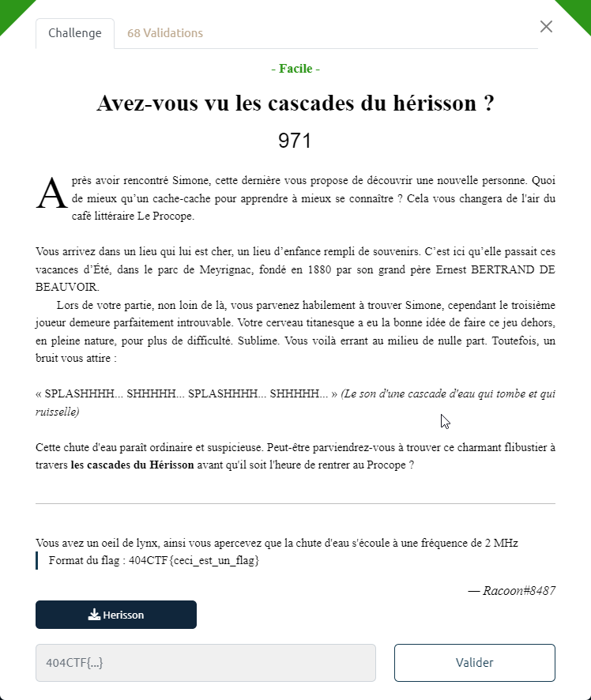

# Avez-vous vu les cascades du hérisson ?

Le fichier `Herisson` est fourni.

On importe le fichier en tant que données brutes (i.e. raw) dans Audacity.

Puis on affiche la vue Spectogramme avec les caractéristiques suivantes :
- échelle linéaire
- plage de fréquence : de 0 à 200 kHz

On voit alors apparaître 2 morceaux d'image avec le flag dessus.

Le flag est donc : `404CTF{413X4NDR3_D4N5_UN3_C45C4D35_?}`
