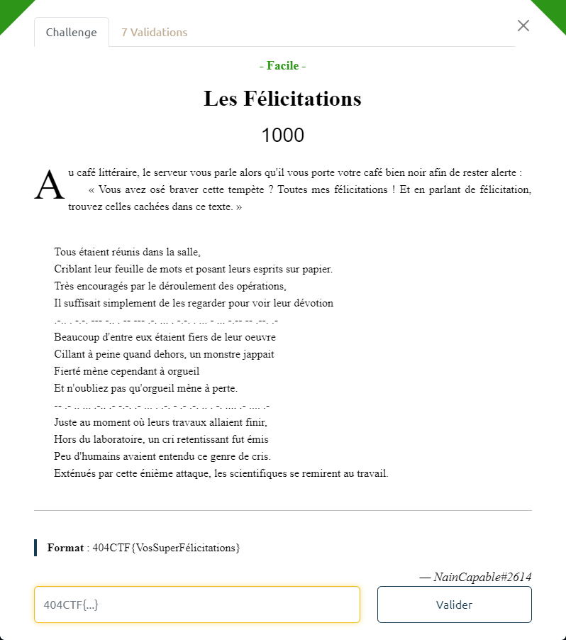
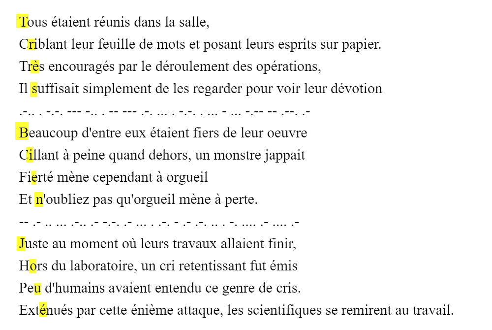

# Les Félicitations



Entre chaque paragraphe, on trouve ce qui ressemble à du code morse :

```txt
.-.. . -.-. --- -.. . -- --- .-. ... . -.-. . ... - ... -.-- -- .--. .-
-- .- .. ... .-.. .- -.-. .- ... . .-. - .- .-. .. . -. .... .- .... .-
```

Son décodage donne :

```txt
LECODEMORSECESTSYMPA
MAISLACASERTARIENHAHA
```

C'est donc une fausse piste :smile:

Par contre, on voit apparaître un message en prenant, pour chaque paragraphe :
- la 1ere lettre de la 1ère phrase
- la 2ème lettre de la 2ème phrase
- etc



On obtient le flag : `404CTF{TrèsBienJoué}`
