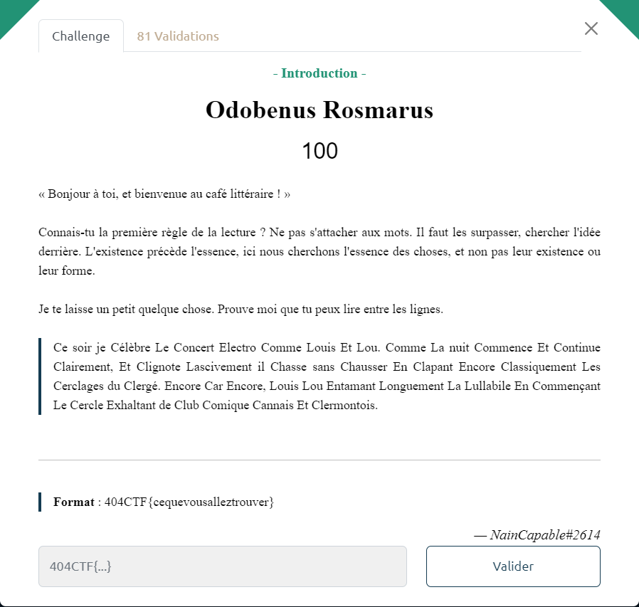

# Odobenus Rosmarus



Le titre du challenge *Odobenus Rosmarus* n'est autre que le nom scientifique du morse (l'animal).

Morse : entre l'animal et le code, il n'y a qu'un pas à franchir.

On constate que le texte comporte des majuscules bizaremment placées et uniquement pour les lettres `C`, `E` et `L` :

```txt
Ce soir je Célèbre Le Concert Electro Comme Louis Et Lou. Comme La nuit Commence Et Continue 
Clairement, Et Clignote Lascivement il Chasse sans Chausser En Clapant Encore Classiquement Les 
Cerclages du Clergé. Encore Car Encore, Louis Lou Entamant Longuement La Lullabile En Commençant 
Le Cercle Exhaltant de Club Comique Cannais Et Clermontois.
```

En ne retenant que les majuscules le texte devient : `CCLCECLELCLCECCECLCCECECLCCECELLELLLECLCECCCEC`

En décodant ce texte en morse en prenant comme correspondance :
- `C` pour Court (i.e. `.`)
- `E` pour Espace
- `L` pour Long (i.e. `-`)

on obtient : `F A C I L E L E M O R S E`

Le flag est donc : `404CTF{facilelemorse}`
