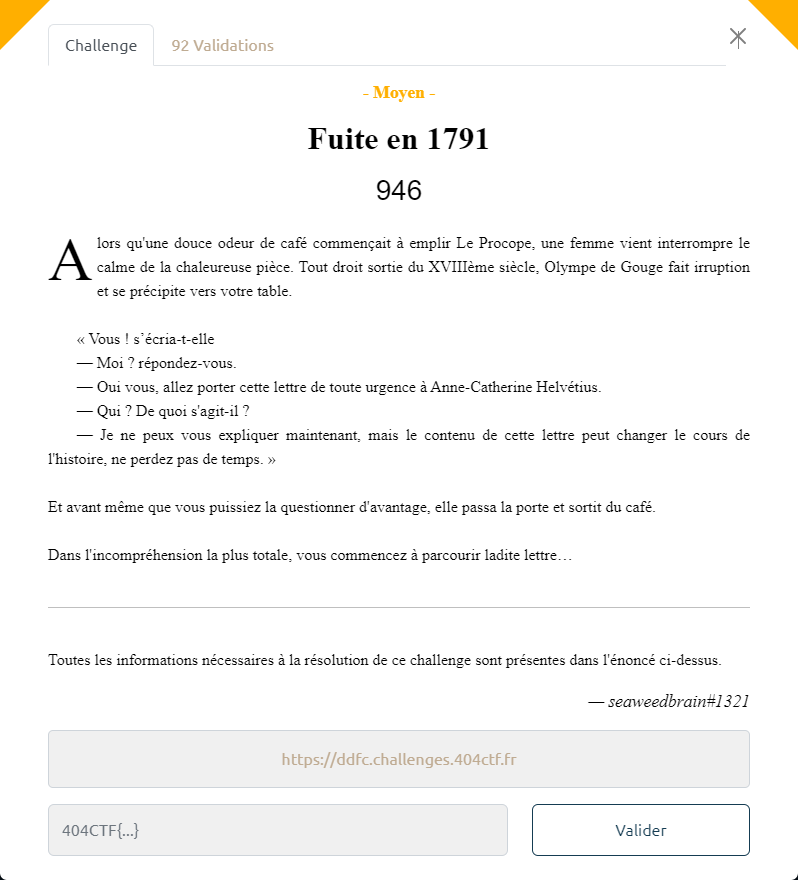

# Fuite en 1791

La page indiquée contient un lien :

Le lien renvoie vers la page https://ddfc.challenges.404ctf.fr/ddfc?expiry=-5625891076&signature=wawF6dC4Hz9g5NyCc3j1KCDcfztFE/sp

Cette nouvelle page indique que le lien est expiré :

Le query parameter `expiry` vaut  `-5625891076`. Cette valeur correspond en timestamp à la date GMT : `Wednesday 21 September 1791 12:28:44`

Si on change la valeur de `expiry`, par exemple `5625891076`, un message d'erreur indique que la signature n'est pas valide :

Avec un query parameter `signature` vide, un message indique que `expiry` et `signature` sont obligatoires :

L'ajout dans la requête HTTP d'un header `Date: Wed, 21 Sep 1791 12:28:44 GMT`, avec pour objectif de faire croire qu'on effectue la requête dans le passé, ne permet pas de débloquer la situation : le message indique toujours que le lien est expiré.

> Les headers de requête possibles : https://en.wikipedia.org/wiki/List_of_HTTP_header_fields#Request_fields

Après quelques tentatives de manipulation de la requête, on se rend compte :
- que la signature est calculée sur le début du l'URL (i.e. https://ddfc.challenges.404ctf.fr/ddfc?expiry=-5625891076)
- si on change les query parameter d'ordre, au lieu de tomber sur le message d'erreur indiquant que le lien est expiré, on obtient celui indiquant que la signature est invalide

Donc le début de l'URL (https://ddfc.challenges.404ctf.fr/ddfc?expiry=-5625891076&signature=wawF6dC4Hz9g5NyCc3j1KCDcfztFE/sp) doit être conservé tel quel.

Par contre, l'ajout de query parameter en fin est possible.

On ajoute donc un 2ème query parameter `expiry` correspondant à un timestamp dans le futur (ex : `expiry=5625891076`) :
- 5625891076 (en GMT: Thursday 11 April 2148 11:31:16)
- normalement on s'attend à ce que la signature soit valide (puisqu'on conserve le début de l'URL)
- que le 2ème `expiry` vienne écraser la valeur du 1er, et soit utilisée pour les contrôles ultérieurs

On adresse donc l'url : https://ddfc.challenges.404ctf.fr/ddfc?expiry=-5625891076&signature=wawF6dC4Hz9g5NyCc3j1KCDcfztFE/sp&expiry=+5625891076

Le flag apparaît en bas de la page : `404CTF{l4_p011uti0n_c_3st_m41}`
