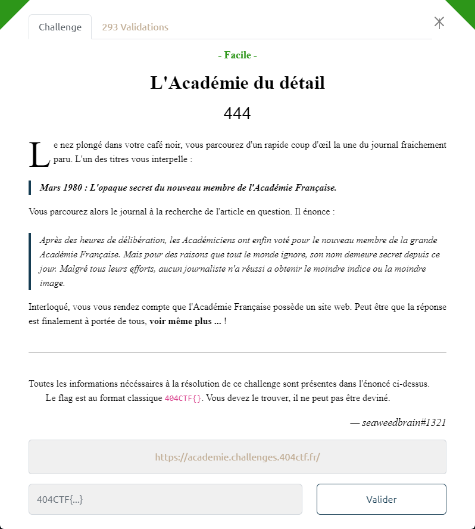
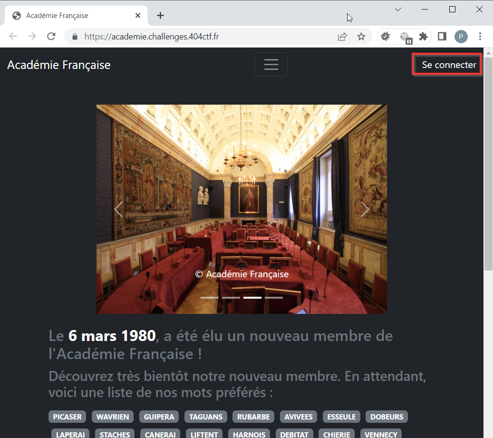
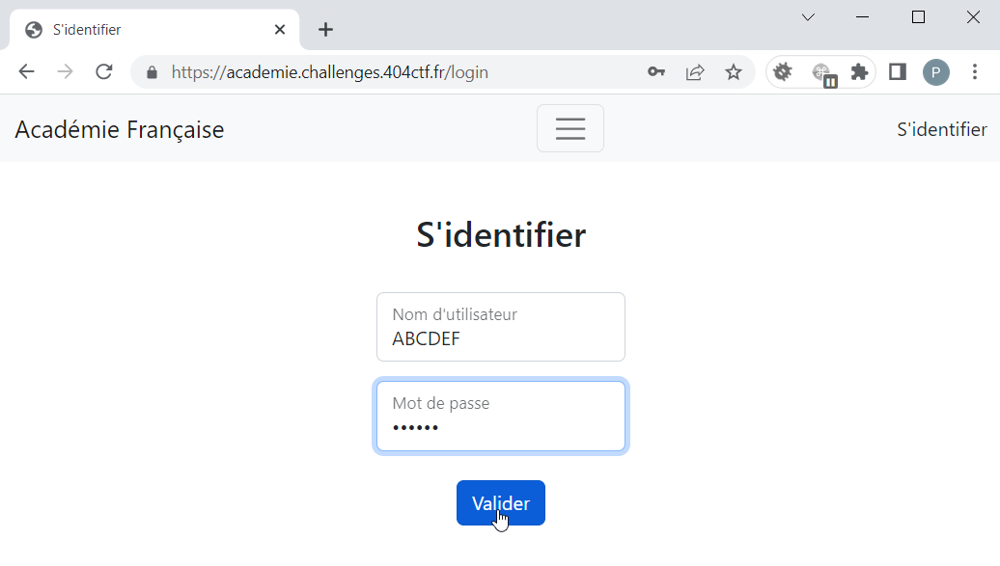
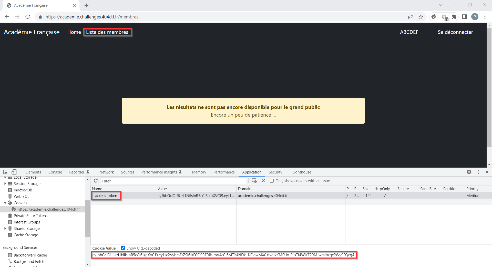
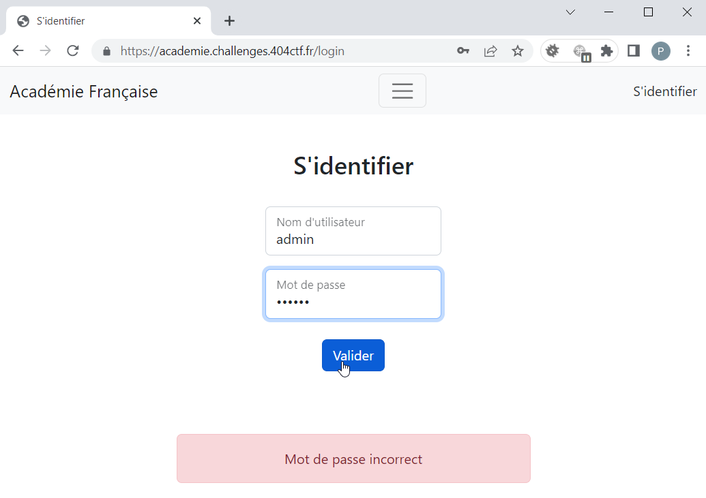
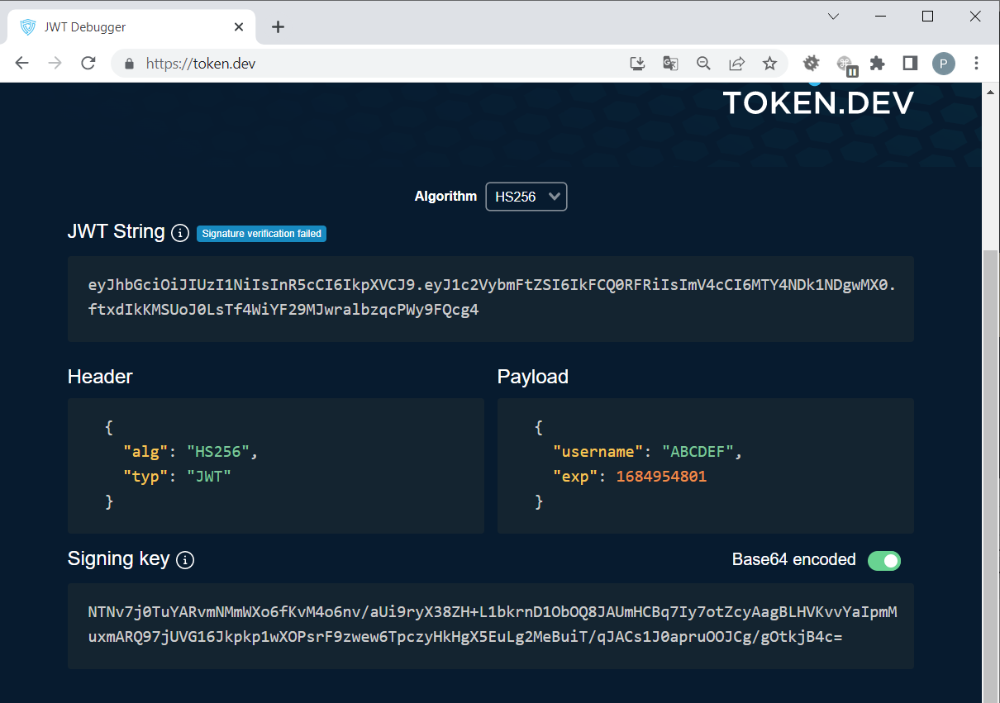
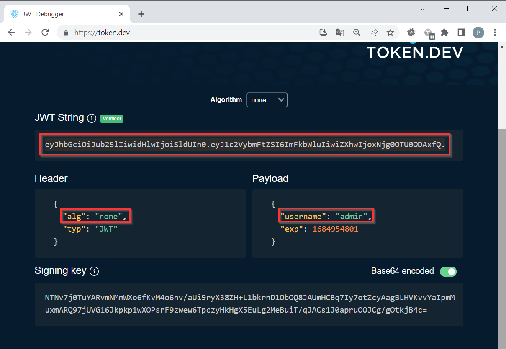
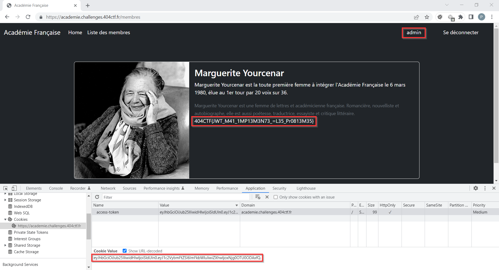

# L'Académie du détail

La page d'accueil du site propose un lien pour se connecter :

On se connecte par exemple avec le compte `ABCDEF`, avec n'importe quelle valeur de mot de passe :

La page d'accueil présente alors un nouveau lien *Liste des membres* que l'on suit. Un message nous indique que les données sont privées pour l'instant :

On suppose donc qu'il faut se connecter en tant qu'`admin`.

Contrairement à n'importe quel login, où on peut saisir n'importe quel mot de passe, si on essaie de se connecter avec le compte `admin`, on a un message `Mot de passe incorrect` :

En 1ère approche, on tente l'exploitation d'une potentielle faille d'injection SQL au niveau du formulaire d'authentification, mais sans succès : les caractères autres qu'alphanumériques sont supprimés.

> avec un login du type : `admin' or '1'='1`, on se retrouve connecté avec le compte `adminor11`

En examinant les cookies, on voit qu'un cookie `access-token` a été créé suite à l'authentification.
Il s'agit d'un token JWT, que l'on peut décoder par exemple sur `https://token.dev/` :

On pense à exploiter une faille sur l'algo de signature, en indiquant qu'il n'y en a pas (i.e. `"alg": "none"`).
En complément on indique que l'utilisateur est `admin`.
On obtient ainsi un nouveau token :

> NB : ne pas oublier un `.` final afin d'avoir une signature "vide"

On utilise ensuite ce token en remplacement du précédent.

On rafraichit la page `/membres`.

On se retrouve authentifié en tant que `admin` avec une page dont le contenu est cette fois-ci accessible :

Le flag est donc :  `404CTF{JWT_M41_1MP13M3N73_=L35_Pr0813M35}`
