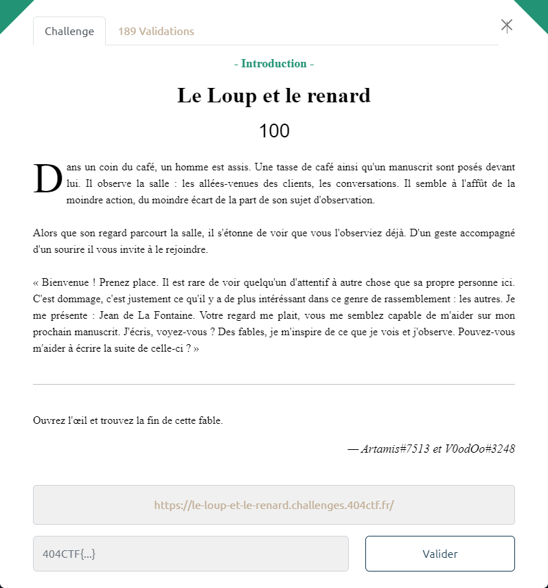
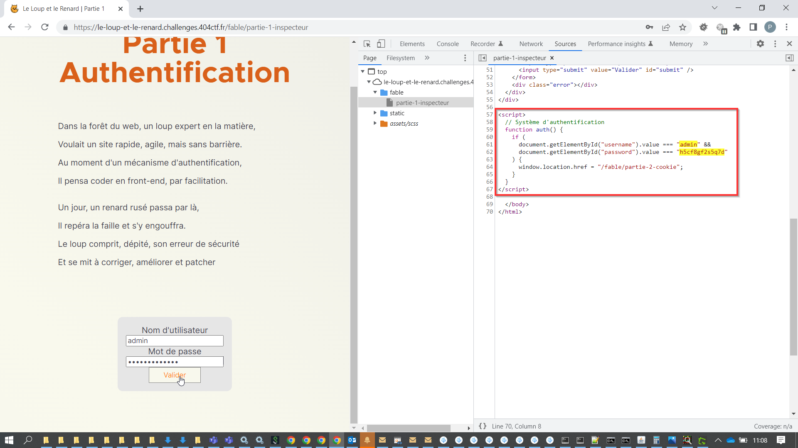
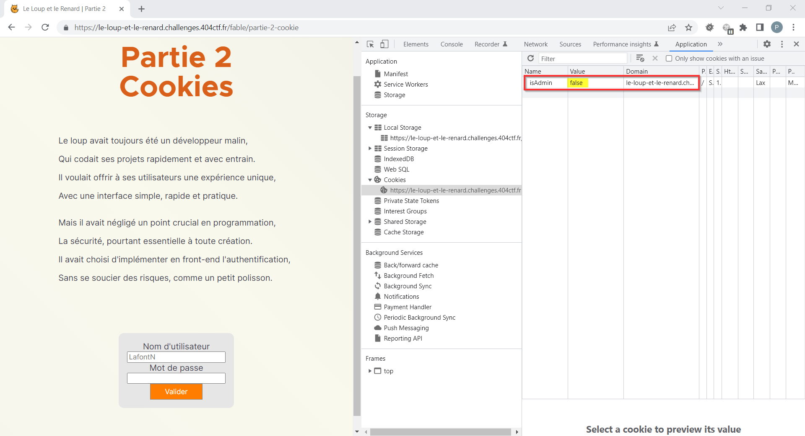
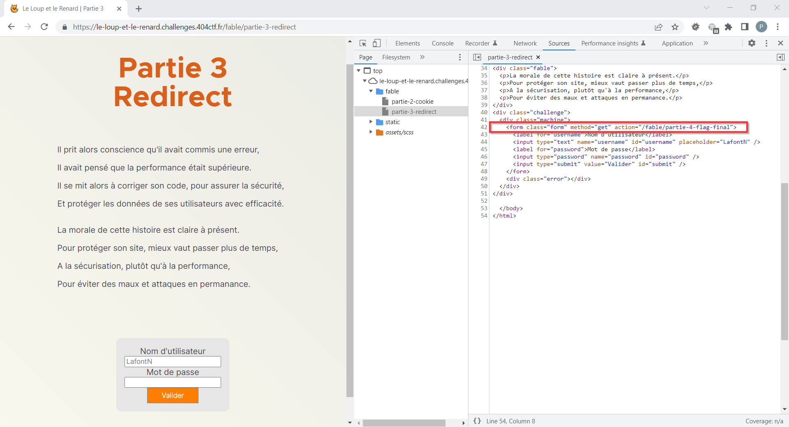

# Le Loup et le renard



La page https://le-loup-et-le-renard.challenges.404ctf.fr/ présente un bouton *Démarrer*.

Celui-ci nous emmène sur la page https://le-loup-et-le-renard.challenges.404ctf.fr/fable/partie-1-inspecteur

Le code source de celle-ci fournit les valeurs à utiliser dans le formulaire :



On est alors redirigé vers la page https://le-loup-et-le-renard.challenges.404ctf.fr/fable/partie-2-cookie

Au passage, un cookie `isAdmin=false` a été posé :



On modifie la valeur du cookie : `isAdmin=true`, puis on rafraichit la page.

On est alors redirigé vers la page https://le-loup-et-le-renard.challenges.404ctf.fr/fable/partie-3-redirect

Le code source de celle-ci montre que le formulaire effectue un simple GET vers /fable/partie-4-flag-final :



Si on suit ce dernier, la page s'affiche brièvement avant de revenir sur la page précédente.

On éviter cet écueil on utilise `curl` :

```bash
curl https://le-loup-et-le-renard.challenges.404ctf.fr/fable/partie-4-flag-final
```

Le flag est présent dans la réponse HTTP retournée :

```html
<!DOCTYPE html>
<html lang="fr">
  <head>
    <meta charset="UTF-8" />
    <meta http-equiv="X-UA-Compatible" content="IE=edge" />
    <meta name="viewport" content="width=device-width, initial-scale=1.0" />
    <link
      rel="shortcut icon"
      href="../static/ico/favicon.ico"
      type="image/x-icon"
    />
    <link rel="stylesheet" href="../static/font/Inter/inter.css" />
    <link rel="stylesheet" href="../static/font/Metropolis/style.css" />
    <link rel="stylesheet" href="../static/css/home.css" />

    <title>Le Loup et le Renard | Partie 4</title>

  </head>
  <body>

<div class="back-to-home">
  <p><a href="/">&#8617; Retour</a></p>
</div>
<div class="title-section">
  <h1>Partie 4<br />Flag</h1>
</div>
<div class="fable">
  <p>Chers développeurs, n'oubliez pas cette leçon,</p>
  <p>Il est préférable de prendre son temps pour la protection.</p>
  <p>L'authentification en front-end est une mauvaise idée,</p>
  <p>Et peut laisser la porte ouverte aux pirates, c'est une réalité.</p>
</div>

<div class="fable">
  <p>Alors, méfiez-vous, chers amis développeurs,</p>
  <p>Et ne négligez jamais la sécurité de vos utilisateurs,</p>
  <p>Car un site rapide et performant, sans sécurité,</p>
  <p>Peut vite devenir une calamité.</p>
</div>
<div>Flag : 404CTF{N0_frOn1_3nD_auTh3nt1ficAti0n}</div>
<script>
  const queryString = window.location.search;
  const urlParams = new URLSearchParams(queryString);
  if (urlParams.has("username") && urlParams.has("password")) {
    const username = urlParams.get("username");
    const password = urlParams.get("password");
    if (!(username === "admin" && password === "Fbqh96BthQ")) {
      document.location = "/fable/partie-3-redirect";
    }
  } else {
    document.location = "/fable/partie-3-redirect";
  }
</script>

  </body>
</html>
```
