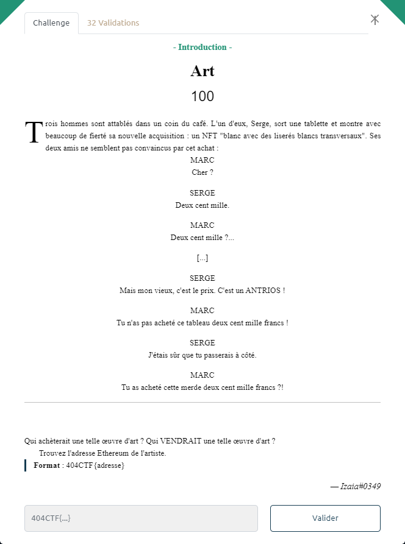

# Art

Un peu de recherche permet d'identifier qu'il s'agit d'un extrait de la pièce ["Art"](https://fr.wikipedia.org/wiki/%C2%AB_Art_%C2%BB) de Yasmina Reza.

Sur opensea, on trouve un compte `Antrios` : https://opensea.io/fr/Antrios

Dont l'adresse ethereum est : `0xD7186D588Ed2AddF8b260d09B108100f264A64A9`

Le flag est : `404CTF{0xD7186D588Ed2AddF8b260d09B108100f264A64A9}`

> on trouve également un autre hommage à cette pièce :  https://opensea.io/fr/assets/ethereum/0x495f947276749ce646f68ac8c248420045cb7b5e/104010113285227076956694724982749666977219410059053849120145432565046122119169
