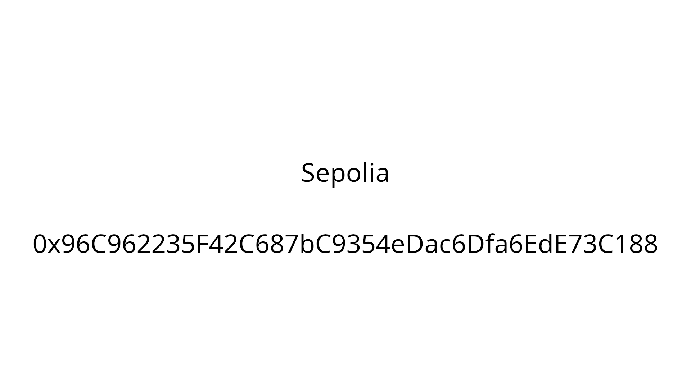

# L'Antiquaire, tête en l'air


Le fichier fourni : [memorandum.txt](memorandum.txt)

En procédant a un décodage hexa du fichier `memorandum.txt`, on observe en fin les données suivantes :

```txt
...
ipfs/bafybeia5g2umnaq5x5bt5drt2jodpsvfiauv5mowjv6mu7q5tmqufmo47i/metadata.json
...
https://shorturl.ac/mysecretpassword
```

Le lien https://shorturl.ac/mysecretpassword est un Rick Roll :smile:

Le fichier `memorandum.txt` étant un token ERC721, on peut donc récupérer le fichier [`metadata.json`](metadata.json) à l'adresse suivante : https://ipfs.io/ipfs/bafybeia5g2umnaq5x5bt5drt2jodpsvfiauv5mowjv6mu7q5tmqufmo47i/metadata.json :

```json
{
    "name": "Le seul et l'unique",
    "description": "Qui sait ce qu'il se cache au bout du chemin ?!",
    "image": "ipfs://bafybeic6ea7qi5ctdp6s6msddd7hwuic3boumwknrirlakftr2yrgnfiga/mystere.png",
    "attributes": [
      {
        "trait_type": "Rarity",
        "value": "Unique"
      }
    ]
}
```

Il contient une référence à une image `mystere.png` que l'on peut récupérer à cette adresse : https://ipfs.io/ipfs/bafybeic6ea7qi5ctdp6s6msddd7hwuic3boumwknrirlakftr2yrgnfiga/mystere.png :



On se rend sur Sepolia à l'adresse `0x96c962235f42c687bc9354edac6dfa6ede73c188` : https://sepolia.etherscan.io/address/0x96c962235f42c687bc9354edac6dfa6ede73c188


Dans la partie `code` on trouve le flag :


Le flag est donc : `404CTF{M3M3_P45_13_73MP5_D3_53CH4UFF3r_QU3_C357_D3J4_F1N1!}`
